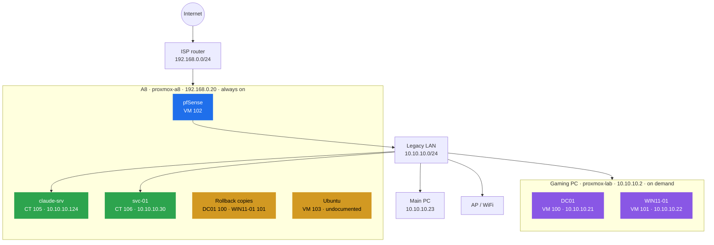
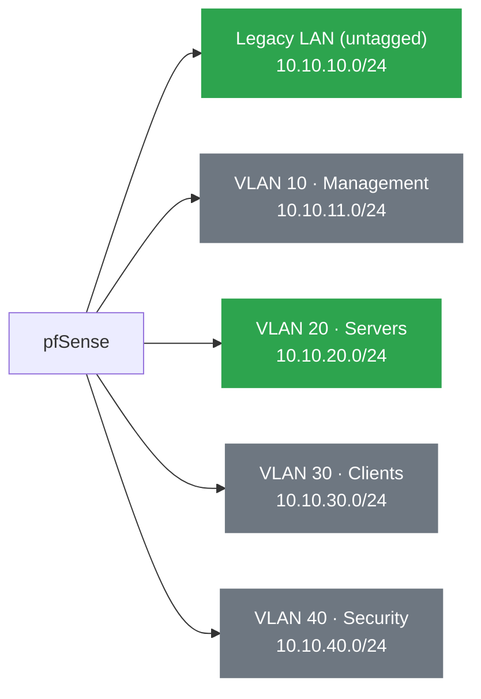
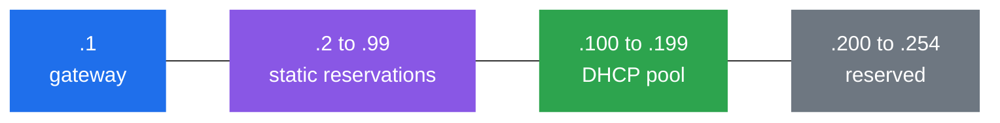
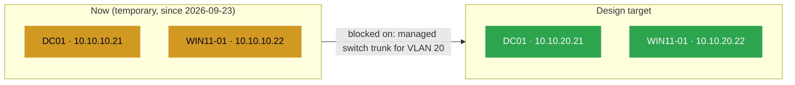
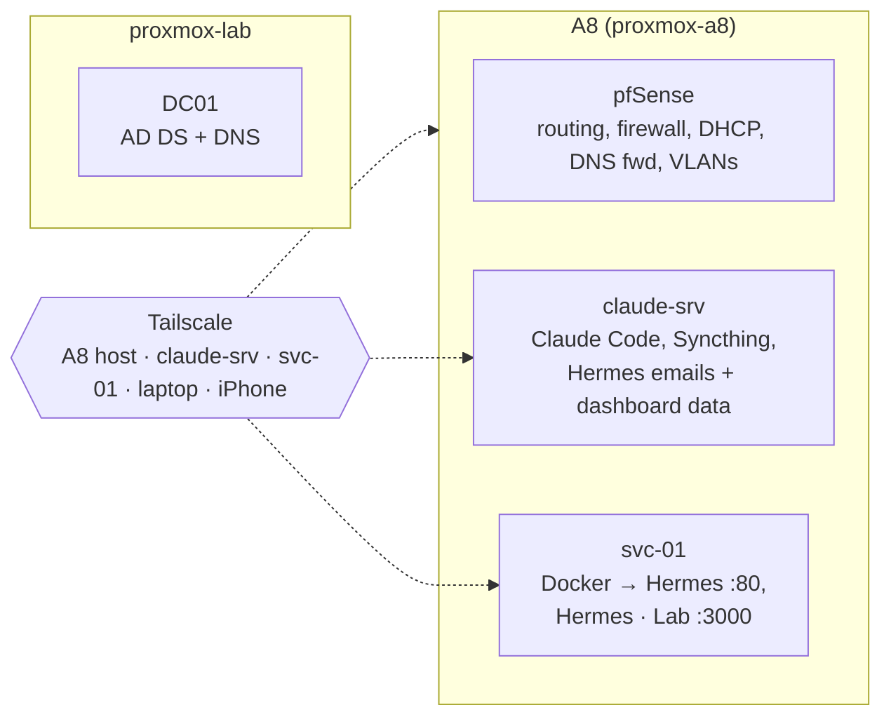

# Homelab Inventory

> [!IMPORTANT] Single source of truth
> Single source of truth for hardware, IPs, and services. If a number in another note disagrees with this file, **this file wins**: update the other note. Related: [Homelab - Project Overview](Homelab%20-%20Project%20Overview.md)

## At a glance

🟦 network core · 🟪 Active Directory · 🟩 services · 🟨 needs attention. DC01 and WIN11-01 are shown at their **temporary** Legacy LAN addresses (see §3).

## 1. Physical hardware

**Status:** 🟢 Active · ⬜ Planned · ⚫ Discarded

|Device|Role|Specs|Status|Why it's here|
|---|---|---|---|---|
|A8 (HP laptop)|Primary Proxmox node (bare metal)|AMD A8-9425, 24GB RAM|🟢 Active|Infra-critical only now: pfSense. DC01/WIN11-01 moved to the lab node 2026-09-23 (see [[Proxmox Lab Setup]]); powered-off rollback copies of both kept here|
|Gaming PC (proxmox-lab)|Secondary Proxmox node (standalone, not clustered)|i5 10th-gen, 6C/12T, 16GB RAM|🟢 Active|Hosts DC01 + WIN11-01, migrated from A8 2026-09-23 via backup/restore. See [[Proxmox Lab Setup]]|
|Ryzen 5 PRO 2400G mini PC|Docker / security services node|n/a|⚫ Not available|Not available as of 2026-09-24. Don't plan workloads on it|
|Vaio (Pentium 2020M)|Lightweight services node (planned)|4GB RAM|⬜ Not yet implemented|Migration exercise + Pi-hole/Home Assistant/Docker|
|~~Ryzen 3 / 8GB mini PC~~|n/a|n/a|⚫ Discarded|No longer part of the plan|

## 2. Network: VLANs (pfSense)

> [!WARNING] Verify before trusting
> `pfSense Configuration.md` (dated 2026-09-11) is the most recent source and is treated as authoritative below. `Network Design.md` and `pfSense Design.md` describe an earlier VLAN numbering (VLAN 20 = LAB-USERS, VLAN 30 = LAB-SERVERS) that **does not match** what's actually configured (VLAN 20 = Servers, VLAN 30 = Clients). Those two design docs need to be updated or explicitly marked "superseded."

🟩 has devices · ⬛ configured but empty

| VLAN | Name       | Subnet          | Gateway      | Purpose                                             | Real devices on it today                           |
| ---- | ---------- | --------------- | ------------ | --------------------------------------------------- | -------------------------------------------------- |
| n/a  | Legacy LAN | `10.10.10.0/24` | `10.10.10.1` | Pre-VLAN flat network; AP/WiFi and untagged devices | Main PC (`10.10.10.8`), AP/WiFi, being phased out |
| 10   | Management | `10.10.11.0/24` | `10.10.11.1` | Admin PC, future PiKVM                              | Empty: Main PC not yet migrated here              |
| 20   | Servers    | `10.10.20.0/24` | `10.10.20.1` | DC01, WIN11-01                                      | **DC01, WIN11-01**, the only populated VLAN       |
| 30   | Clients    | `10.10.30.0/24` | `10.10.30.1` | Mobile/WiFi devices                                 | Empty                                              |
| 40   | Security   | `10.10.40.0/24` | `10.10.40.1` | Future Vaio, Kali                                   | Empty                                              |

**Address plan inside every subnet:**

DHCP range on every VLAN: `.100` to `.199`.

## 3. Devices: IP / DNS / domain status

> [!CAUTION] Conflicting values found across notes, flagged per row
> Treat the "Current (best guess)" column as needing your confirmation, not as settled fact.

| Device            | Current (best guess)                                                      | Conflicting values found                                                                                                                                           | Source of conflict                                                                        |
| ----------------- | ------------------------------------------------------------------------- | ------------------------------------------------------------------------------------------------------------------------------------------------------------------ | ----------------------------------------------------------------------------------------- |
| Proxmox host (A8) | `192.168.0.20`, sits **outside pfSense**, on the ISP router's network    | `192.168.0.10` in `Homelab Overview.md`; `192.168.0.20` in `Proxmox Setup.md` and `pfSense Configuration.md`                                                       | Overview.md predates the pfSense migration and was never updated                          |
| Proxmox host (lab)| `10.10.10.2`, Legacy LAN, behind pfSense NAT                              |                                                                                                                                                                     | New as of 2026-09-23, see [[Proxmox Lab Setup]]                                            |
| DC01              | **Temporary: `10.10.10.21`, Legacy LAN.** Design target is `10.10.20.21`, VLAN 20 (Servers) | `192.168.0.21` in `DC01.md`; `10.10.10.21` in an old pfSense rule (now reused, not stale); `10.10.20.21` is the intended VLAN 20 address, confirmed in `pfSense Configuration.md` and `Active Directory Lab.md` | Moved to `proxmox-lab` 2026-09-23, which has no VLAN trunk to the A8 yet, see [[Proxmox Lab Setup]] §"VLAN 20 broken by the move" |
| WIN11-01          | **Temporary: `10.10.10.22`, Legacy LAN.** Design target is `10.10.20.22`, VLAN 20 (Servers), gateway `10.10.20.1`, DNS `10.10.20.21` | `192.168.0.22 (planned)` in `Proxmox Setup.md`                                                                                                                     | Same cause as DC01 above: moved to `proxmox-lab` before VLAN 20 trunking existed          |
| claude-srv (CT 105 on A8) | `10.10.10.124` (DHCP, legacy LAN), no static mapping yet, Tailscale `100.88.249.127` |                                                                                                                                                                     | New as of 2026-09-23, see [[claude-srv]]                                                  |
| svc-01 (CT 106 on A8) | `10.10.10.30` (static, legacy LAN), Tailscale `100.102.216.72` |                                                                                                                                                                     | New as of 2026-09-24, replaces privileged CT 104. See [[svc-01]]                          |
| Ubuntu (VM 103 on A8) | Unknown, stopped | Not documented anywhere | Found 2026-09-24 in `qm list`. Purpose unknown, needs the same audit CT 104 got |
| Main PC           | `10.10.10.23` (legacy LAN)                                                |                                                                                                                                                                    | Pending migration to Management VLAN (10)                                                 |
| Domain name       | `ad.jnclydehl.local`, confirmed via live DNS query (2026-09-16 incident), docs updated 2026-09-18 | Historical: `jnclydehl.local` (old Overview/Design text), `jn.clydehl.local` (typo in `DC01.md` build log) | Resolved, see [[Active Directory Design]] and [[DC01]]                                   |
| NetBIOS           | `JNCLYDEHL`                                                               | consistent everywhere it appears                                                                                                                                   |                                                                                           |

**Where DC01 and WIN11-01 are now vs where they belong:**

## 4. Services running

|Service|Runs on|Purpose|
|---|---|---|
|pfSense|VM on A8 (Proxmox)|Router/firewall, DHCP, DNS forwarding, VLAN segmentation|
|Active Directory Domain Services + DNS|DC01 (VM on A8)|Domain authentication, name resolution for the domain|
|Claude Code + Syncthing|claude-srv (CT 105 on A8)|Always-on Claude sessions; vault and Claude memory synced with the laptop. See [[Claude Server Design]]|
|Docker|svc-01 (CT 106 on A8)|Container host for lab services. See [[svc-01]]|
|Hermes Dashboard|svc-01 `http://10.10.10.30` (page, nginx), claude-srv `~/dashboard` (data)|Main dashboard: briefing, errands, calendar, mail, job search, roadmap, lab status, lesson. See [[Hermes Dashboard]]|
|Hermes · Lab (Homepage)|svc-01, `http://10.10.10.30:3000`|Lab-only dashboard: roadmap, hosts, automations, watchdogs, bookmarks. See [[Homepage]]|
|Hermes report emails|claude-srv, timers 08:00 / 22:00|Morning report and evening recap by email, written by Claude from live facts. See [[Hermes]]|
|Tailscale|A8 Proxmox host, claude-srv, svc-01, laptop, iPhone|Secure remote management of Proxmox (and by extension all VMs/consoles) without exposing ports to the internet|

## 5. Known documentation debt (last reviewed 2026-09-18)

- [x] **Domain name reconciled: `ad.jnclydehl.local` is canonical**, confirmed via a direct DNS query against DC01 during the 2026-09-16 incident (SOA record returned). `DC01.md`'s build-log typo (`jn.clydehl.local`) was a transcription error, not the real forest name. Corrected in `DC01.md` and `Active Directory Design.md` (2026-09-18).
- [x] **NetBIOS name confirmed `JNCLYDEHL`** via `Get-ADDomain` on DC01 (2026-09-24). The earlier `AD\Administrator` suspicion was wrong; `DC01.md` and `Active Directory Design.md` updated.
- [x] Update `DC01.md` network section: no longer shows the pre-VLAN IP; rewritten as Current State + Change Log (2026-09-18)
- [ ] Remove/disable the stale pfSense rule pointing at `10.10.10.21` for DC01
- [x] `pfSense Design.md`: was marked done previously but the stale VLAN table was still there with no flag. Actually fixed now (2026-09-18): added a "superseded" banner pointing here.
- [x] Fill in the incomplete section in `WIN11-01.md` (placeholder line never completed)
- [x] Empty index files with no content (`HomeLab.md`, `1 - Infrastructure.md`, etc.) removed. Note: this left dangling `[[1 - Infrastructure]]`-style wikilinks in `Homelab - Project Overview.md` pointing at now-deleted files; fixed 2026-09-18.
- [ ] `HomeLab/Plan.md`, `Roles.md`, `Roles 2.md`: deleted from the vault already (confirmed gone in git status); no longer an open item.
- [x] **Security note:** re-checked 2026-09-18. No plaintext passwords or personal email found in current `DC01.md` or any tracked doc. The old file that had them (`Homelab Overview.md`) no longer exists. Closing this, but keep the habit of not typing real credentials into notes going forward.
- [ ] **New: DC01's own preferred DNS is set to the gateway (`10.10.20.1`), not to itself.** Contradicts the DNS rule stated in `Active Directory Design.md` ("DC01 does not use the VLAN gateway as DNS"). This is a real AD anti-pattern, not just a doc issue: verify and fix on the live box. See `DC01.md` Current State. Note: while DC01 is on the temporary `10.10.10.x` addressing (see below), it's pointed at itself (`10.10.10.21`), so re-check this once it's back on VLAN 20.
- [ ] **New: WAN GUI access on pfSense was temporarily opened during initial setup** (`pfSsh.php playback enableallowallwan`) and no later doc confirms it was closed again. `pfSense Configuration.md` has no WAN rule table at all. Check `System > Advanced` and `Firewall > Rules > WAN` on the live box. See `pfSense Network Configuration.md`.
- [ ] **New: broken embed.** `AD Administration.md` references a screenshot (`aduc-ou-tree-2026-09-16.png`) that was never actually saved to attachments.
- [x] ~~Remove/disable the stale pfSense rule pointing at `10.10.10.21` for DC01~~. **Superseded 2026-09-23:** this rule is now load-bearing, not stale. DC01 was moved to `proxmox-lab` before that node had a VLAN 20 trunk, and is temporarily readdressed to `10.10.10.21` on the Legacy LAN. Do not remove this rule until VLAN 20 trunking is restored (see [[Proxmox Lab Setup]]).
- [x] **Fixed 2026-09-24: DC01 clock was 9 hours ahead.** Time zone set to `Romance Standard Time`, NTP source `pool.ntp.org` via `w32tm`; RootDSE `currentTime` now matches `claude-srv` to the second. RootDSE `currentTime` read `2026-09-25 01:41Z` when real UTC was `2026-09-24 16:42Z`. Pattern fits a Pacific time zone with Barcelona wall-clock time set by hand. DC01 is the domain time source, so every domain member inherits it: log timestamps are wrong, and any non-domain client (Linux, sssd, Kerberos from `claude-srv`) is outside the 5-minute Kerberos window. Fix time zone and give DC01 a real external NTP source.
- [ ] **New (2026-09-24): DC01 and WIN11-01 are evaluation builds** (Server 2022 Standard Evaluation, Win11 Enterprise Evaluation). An expired eval Server shuts down every hour. **DC01:** expires ~2026-11-27 (64 days left on 2026-09-24), 6 rearms left, each `slmgr /rearm` + reboot resets to 180 days: rearm around mid-November, not earlier (rearming early wastes the remaining days). **WIN11-01:** expires ~2026-12-09 (76 days left on 2026-09-24), only 2 rearms left: plan a rebuild (or a scripted re-provision) rather than relying on rearms.
- [ ] **New: VLAN 20 has no physical path to `proxmox-lab`.** DC01 and WIN11-01 are both temporarily off-VLAN on the Legacy LAN (`10.10.10.21`/`.22`) since the migration on 2026-09-23. A managed switch is owned but not yet configured to trunk VLAN 20 (and ideally 10/30/40) between the A8's `nic0` and the lab node's NIC. Once wired and configured, restore `tag=20` on both VMs' `net1` on `proxmox-lab` and re-point them to `10.10.20.21`/`.22`. Full detail in [[Proxmox Lab Setup]].
- [ ] **New: two powered-off rollback copies of DC01 and WIN11-01 exist on the A8** (originals, pre-migration, `tag=20` restored on their NICs). Keep for a rollback window, then delete once the lab-node copies have been stable for a while. Never power on alongside the lab copies: duplicate DC01 risks a USN rollback.
