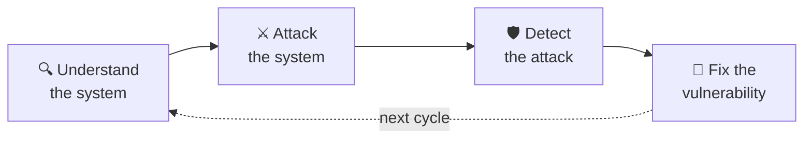
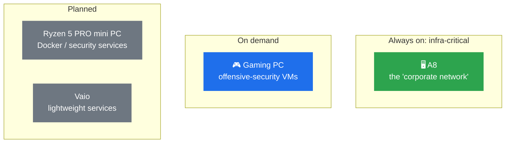
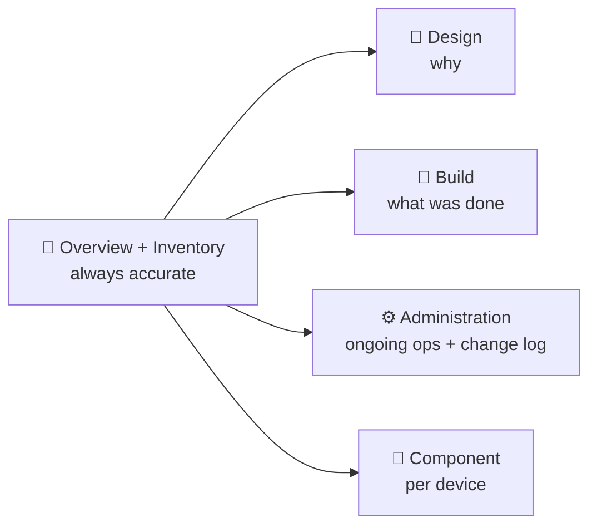

# Homelab Project Overview

> [!IMPORTANT] Master document
> This is the master document. Read this first before touching any other folder. Related: [Homelab - Inventory](Homelab%20-%20Inventory.md)

## 1. Objective

This homelab is the practical, hands-on side of a 6-month career transition:

🟩 complete · 🟨 in progress · ⬛ pending

The day job (Econocom, N1/N2 support at Mango) provides real enterprise exposure to tickets, AD, M365, and hardware support. The homelab exists to provide what the job doesn't: a safe environment to **build infrastructure from scratch and then deliberately break it**.

The end target is a **red team / penetration testing** profile, but this lab is deliberately sequenced to build sysadmin and infrastructure fundamentals first, rather than jumping straight to Kali and CTFs. The reasoning: attacking a system you don't understand teaches you to copy exploits, not to think like an attacker or a defender.

## 2. Why this order

Each phase below produces something that later phases attack, monitor, or automate. Nothing is built "for the certificate": everything has a downstream purpose in the red-team lab.

## 3. Phases

| Phase | Focus                                                                                                  | Status                                                                                                                     |
| ----- | ------------------------------------------------------------------------------------------------------ | -------------------------------------------------------------------------------------------------------------------------- |
| A     | pfSense: firewall rules, NAT, logging, allow/deny                                                     | 🟡 In progress                                                                                                             |
| B     | VLAN segmentation: Management / Servers / Clients / Security zones, inter-VLAN control                | 🟡 Started (VLANs exist in pfSense; only Servers has real devices, see [Homelab - Inventory](Homelab%20-%20Inventory.md)) |
| C     | Enterprise AD: departmental OUs, groups, service accounts, GPOs, delegation                           | 🟡 In progress (C1 started, see [[AD Administration]])                                                    |
| D     | PowerShell / automation: scripted user/OU/group/VM creation, rebuildable environments                 | ⬜ Pending                                                                                                                  |
| E     | Microsoft cloud: Entra ID, hybrid identity, M365, Intune, Autopilot, Conditional Access               | ⬜ Pending                                                                                                                  |
| F     | Security monitoring: Sysmon, Windows event logging, SIEM (Wazuh), detection rules                     | ⬜ Pending                                                                                                                  |
| G     | Offensive security lab: attacker node, recon/enum, AD attacks, privesc, lateral movement, persistence | ⬜ Pending                                                                                                                  |
| H     | Red team scenario + professional pentest report                                                        | ⬜ Pending                                                                                                                  |

> [!NOTE] Current position
> Transitioning from Phase A into Phase B/C: pfSense rules are mostly locked down, VLANs exist but are only partially populated, AD has its OU/group foundation.

## 4. Hardware roles (why each machine exists)

See [Homelab - Inventory](Homelab%20-%20Inventory.md) for exact specs/IPs/status. Summary of intent:

- **A8**: primary infrastructure node. Runs Proxmox bare metal, hosts pfSense, DC01, and WIN11-01. This is the "corporate network" side of the lab.
- **Gaming PC**: secondary Proxmox node, reserved for on-demand offensive-security VMs (Kali, vulnerable machines). Kept separate from A8 so infra-critical services (pfSense, DC01) never depend on a machine that dual-boots and isn't always on.
- **Ryzen 5 PRO mini PC (planned)**: future node for Docker/security services and offensive workloads, once RAM is expanded.
- **Vaio (planned)**: future lightweight-services node (Pi-hole, Home Assistant, Docker), explicitly kept as a "migrate an old machine into the lab" exercise.

## 5. Documentation structure (how we keep this from becoming one giant file)

- **Design docs** (e.g. `pfSense Design.md`, `Active Directory Design.md`): architecture and rationale, not a build diary.
- **Build/implementation docs** (e.g. `DC01.md`, `pfSense Installation.md`): what was actually done, step by step.
- **Administration/operations docs** (e.g. `AD Administration.md`): ongoing operational changes, with a dated change log.
- **Component docs** (e.g. `WIN11-01.md`): per-device configuration.
- **This file + [Homelab - Inventory](Homelab%20-%20Inventory.md)**: the two docs that stay accurate at all times, because everything else links back to them.

## 6. Known open items

- [ ] Several docs still reference the pre-VLAN legacy IP scheme (`10.10.10.x` / `192.168.0.x`) and need a pass to confirm/update against current state tracked in [Homelab - Inventory](Homelab%20-%20Inventory.md).
- [x] ~~Domain name written inconsistently across docs~~: resolved 2026-09-18, canonical form is `ad.jnclydehl.local` (see [Homelab - Inventory](Homelab%20-%20Inventory.md) §3). NetBIOS name still needs a live confirm.
- [ ] Proxmox management UI (`192.168.0.20`) still sits outside pfSense, on the ISP router's network, not yet migrated behind the firewall.
- [ ] No inter-VLAN firewall rules exist yet (default-deny between segments, which is correct for now, but Phase B isn't complete until deliberate inter-VLAN rules are added).
