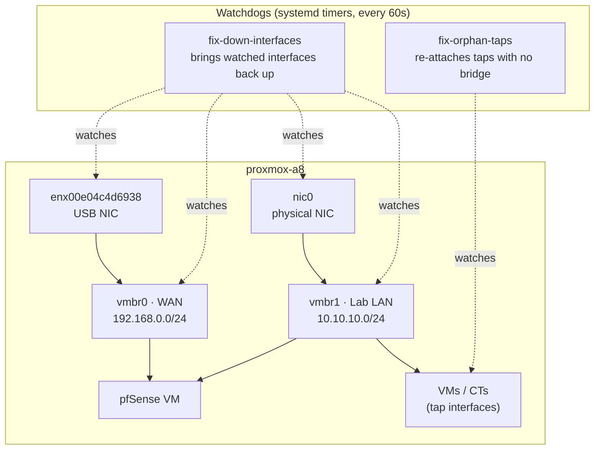
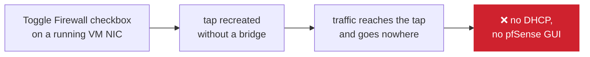
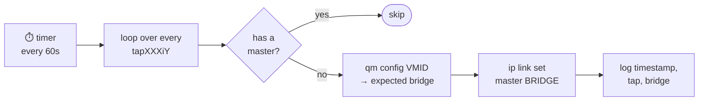

# Proxmox Administration

**Host:** A8 (proxmox-a8), see [[Proxmox Setup]]



| Watchdog | Catches | Fix it applies | Log |
|---|---|---|---|
| fix-orphan-taps | a `tapXXXiY` with no `master` bridge | `ip link set <tap> master <bridge>` | `/var/log/bridge-tap-watchdog.log` |
| fix-down-interfaces | a watched interface that is admin-down | `ip link set <iface> up` | `/var/log/iface-down-watchdog.log` |

**Watchdog: fix-orphan-taps**
- Script (tracked in repo): [[fix-orphan-taps.sh]] (`HomeLab/5 - Automation/scripts/fix-orphan-taps.sh`)
- Deployed at: `/usr/local/bin/fix-orphan-taps.sh`
- Systemd units: `/etc/systemd/system/fix-orphan-taps.service`, `/etc/systemd/system/fix-orphan-taps.timer`
- Timer: `OnBootSec=10`, `OnUnitActiveSec=60`
- Log: `/var/log/bridge-tap-watchdog.log`
- Function: detects `tapXXXiY` interfaces with no `master` (bridge) assigned and automatically reattaches them to the correct bridge, looking up the expected bridge via `qm config <vmid>` on the matching `netN` line
- Status: active, `enabled` (survives reboot), verified live end to end 2026-09-18 (see Change Log)

**Watchdog: fix-down-interfaces**
- Script (tracked in repo): [[fix-down-interfaces.sh]] (`HomeLab/5 - Automation/scripts/fix-down-interfaces.sh`)
- Deployed at: `/usr/local/bin/fix-down-interfaces.sh`
- Systemd units: `/etc/systemd/system/fix-down-interfaces.service`, `/etc/systemd/system/fix-down-interfaces.timer`
- Timer: `OnBootSec=10`, `OnUnitActiveSec=60`, `Persistent=true`
- Log: `/var/log/iface-down-watchdog.log`
- Function: checks a fixed list of critical interfaces (`vmbr0`, `vmbr1`, `enx00e04c4d6938`, `nic0`) every 60s and runs `ip link set <iface> up` on any that are admin-down. Does not scan the whole host, only the watched list.
- Status: active, running alongside fix-orphan-taps since before this was documented. Found and tracked in repo 2026-09-18, was not committed anywhere, only existed on the host.

**Host bridges:**
- `vmbr0`: WAN / external network (192.168.0.0/24, uplink `enx00e04c4d6938`)
- `vmbr1`: Lab internal LAN (10.10.10.0/24, uplink `nic0`)

## Change Log

### 2026-09-17/18: Incident, LAN went down after toggling a NIC firewall setting in Proxmox

**Root cause:** modifying the Firewall checkbox on a running VM's NIC (hot hotplug) caused the tap interface to be recreated without being reattached to its bridge.

**Symptom:** [[pfSense Configuration]] showed the LAN interface with the correct IP from inside the VM, but the corresponding host side tap (`tap102i1`, later reproduced with `tap103i1` during testing) had no `master` in `bridge link`. Traffic reached the tap and went nowhere from there: LAN clients got no DHCP lease, pfSense webConfigurator unreachable over LAN.



**Manual fix:**
```bash
ip link set <tap> master <bridge>
```

**Automated fix:** `fix-orphan-taps.sh`. Loops through every `tapXXXiY` interface on the host, checks whether it has a `master`, and if not, queries `qm config <vmid>` to find the expected bridge, reattaches it with `ip link set`, and logs timestamp, tap, and bridge.



**Automation:** systemd `.service` (oneshot) + `.timer` (60s) instead of cron, for `journalctl` integration.

**Verification:** tested end to end by forcing `ip link set tap103i1 nomaster`. The watchdog detected and reattached it automatically within the next timer run (≤60s), confirmed via `bridge link` and `journalctl -u fix-orphan-taps.service`.

> [!NOTE] Pending
> - Verify VM 103's net1 config persists correctly across a host reboot, not just when set live
> - Confirm whether the hotplug bug is consistently reproducible or intermittent

### 2026-09-18: Script tracked in repo, bugs fixed

The script existed only on the Proxmox host and was never committed, so a prior session's edits to it were lost. Now tracked at `scripts/fix-orphan-taps.sh` alongside this doc.

Fixed while re-adding it to the repo:
- `if ip link set ...; do` was a syntax error (`do` is for loops, not `if`), the script would not run at all as it stood. Changed to `then`.
- Missing a closing `fi` for the nested `if` (has-master check / link-set-success check).
- `$date` was only set on the success branch, so the failure-path log line referenced an unset/stale value. Moved the timestamp above the inner `if` so both branches log it correctly.
- `grep "net$netidx"` wasn't anchored, so `net1` would also match `net10` on a host with 10+ NICs. Anchored to `net${netidx}:`.

Deployed via `deploy.sh` during the CI/CD setup below, host now runs the fully anchored repo version, no drift remaining.

### 2026-09-18: Live re-verification (SSH), and fix-down-interfaces discovered

Re-ran the end-to-end test over SSH against `proxmox-a8` (`root@100.121.216.124` via Tailscale), this time capturing full evidence:

- `systemctl daemon-reload` + `enable --now fix-orphan-taps.timer` (no-op, already `enabled`/`active`)
- Started VM 103 (Ubuntu, non-critical; pfSense and DC01 were deliberately left untouched) to get a live `tap103i1`
- `ip link set tap103i1 nomaster`, confirmed orphaned via `ip link show` (no `master` in output)
- Waited (polled), watchdog fired within ~40s and reattached it automatically:
  ```
  tap103i1 no tiene master
  vmbr1
  bridge linked
  2026-09-18 16:47:23 - fixed tap103i1 -> vmbr1
  ```
  `fix-orphan-taps.service` exited `status=0/SUCCESS`; confirmed via `journalctl -u fix-orphan-taps.service` and `/var/log/bridge-tap-watchdog.log`
- VM 103 stopped again afterward to restore original state

While checking `systemctl list-timers`, found a second, previously undocumented watchdog already running on the host: **fix-down-interfaces** (see its own section above). It handles a different failure mode (admin-down critical host interfaces, not orphaned VM taps) and was never committed anywhere, pulled and added to the repo this session before it could be lost the same way fix-orphan-taps was.

### 2026-09-18: CI/CD pipeline for watchdog scripts

Scripts were getting lost/drifting because the only place they existed was hand-edited directly on the host. Built a real pipeline so the repo is the source of truth end to end: write → push → CI lint → merge → auto-deploy.

**CI**: `.github/workflows/ci.yml`. Runs on every push/PR touching any `*.sh`: `bash -n` syntax check, then `shellcheck --severity=warning`. Would have caught the `do`/`then` bug automatically, before a human ever had to notice.

**CD**: `.github/workflows/deploy.yml`. On push to `main` touching either watchdog script: GitHub-hosted runner joins the Tailscale tailnet as an ephemeral node (`tailscale/github-action`, scoped by an OAuth client's `tag:ci-deploy`), then runs `scripts/deploy.sh` for each script over SSH.

**Deploy key, least-privilege:** a dedicated ed25519 keypair (`~/.ssh/deploy-keys/homelab-ci-deploy`, generated 2026-09-18, fingerprint `SHA256:OVcs3Lf6ZgdsgKNRV2573qRpfKMiv/xkD/4Y4w8esU4`), not the personal keys already on the host. Restricted in `authorized_keys`:
```
restrict,command="/usr/local/bin/ci-deploy-watchdog.sh",no-port-forwarding,no-X11-forwarding,no-agent-forwarding,no-pty <pubkey>
```
`restrict` strips port/X11/agent-forwarding and pty allocation; `command=` forces every connection through [[ci-deploy-watchdog.sh]] regardless of what the client asks for. That wrapper only accepts `deploy <script> <unit>` where both are on a hardcoded allowlist (`fix-orphan-taps.sh`/`fix-orphan-taps`, `fix-down-interfaces.sh`/`fix-down-interfaces`), reads the new script body from stdin, refuses to install anything that fails `bash -n`, then restarts only the matching timer. A leaked key can deploy one of two known scripts and nothing else, verified by testing `whoami`/`cat /etc/shadow` (denied) and an off-allowlist script name (denied) through the key before trusting it with CI.

**Local usage:** `scripts/deploy.sh <script> <unit>`: same path CI uses, so a local deploy and a CI deploy behave identically.

**Status:** setup completed and first deploy verified on 2026-09-22. Design, security model, credentials, and procedures now live in [[Automation Design]] and [[Automation Administration]].

### 2026-09-19: Scripts moved to 5 - Automation

Automation now has its own folder, `HomeLab/5 - Automation/scripts/`, instead of living under Infrastructure. Reason: the scripts and the pipeline are their own domain and will grow beyond Proxmox (AD provisioning, PowerShell). Moved with `git mv` so history follows. Updated the path filters and commands in `.github/workflows/deploy.yml` and the script paths in this doc. `.github/workflows/` stays at the repo root because GitHub only reads workflows from there. Local `bash -n` passes on all four scripts; CI/deploy not yet run against the new paths.

### 2026-09-22: Pipeline live, first deploy verified

Secrets, Tailscale policy and OAuth client set up; CI and Deploy both green on the first push. Both watchdog scripts on this host are byte-identical to the repo (SHA-256 match) and were written by the pipeline. Watchdogs unaffected: both timers active, no orphaned taps. Detail and evidence in [[Automation Administration]].
