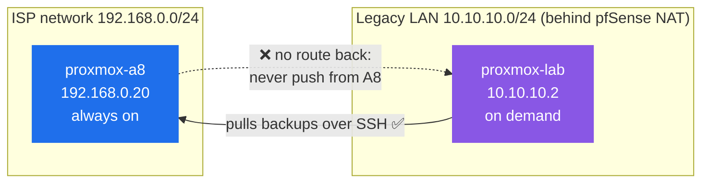
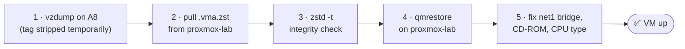
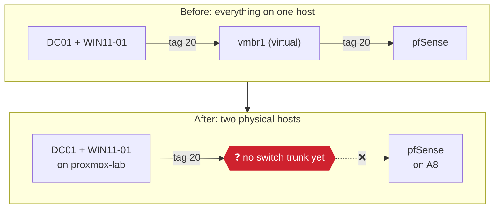

# Proxmox Lab Setup

Related: [[Proxmox Setup]] · [[Proxmox Administration]] · [Homelab - Inventory](<Homelab - Inventory.md>) · [[Active Directory Design]]

## Current State

Standalone nodes, not a cluster: the A8 must never lose quorum when the lab node is off.

- **Host:** `proxmox-lab`: i5 10th-gen, 6C/12T, 16GB RAM (gaming PC, previously blocked on no USB/wired Ethernet at its location, now resolved)
- **Architecture:** standalone node, not clustered with A8. Chosen over clustering to avoid two-node quorum risk: A8 must never lose quorum when this node is powered off, since A8 also runs pfSense. See [[Proxmox Administration]] for A8's bridge/watchdog setup.
- **Network:** single physical NIC, `vmbr0` only. No `vmbr1` on this host.
- **Storage:** `local-lvm` removed (`lvremove`), space reclaimed into `local`, same pattern as the A8 (see [[Proxmox Setup]]).
- **Access:** root SSH, key-based only (A8 has no password auth). This node's own key was added to the A8's `authorized_keys` so it can pull backups; A8 cannot reach this node directly (A8 sits on `192.168.0.0/24` outside pfSense, this node is on `10.10.10.0/24` behind pfSense NAT with no route back), so all transfers are pulled from this node, never pushed from the A8.
- **VMs hosted:** DC01 (100), WIN11-01 (101), migrated from the A8 by backup/restore, not live migration.

### VM specs (as run on this host)

| VM | RAM | vCPU | CPU type | Disk bus |
|---|---|---|---|---|
| DC01 (100) | 6GB (bumped from 4GB, unconfirmed if applied, verify with `qm config 100 \| grep ^memory`) | 2 | default (`kvm64`) unless changed | `ide0` |
| WIN11-01 (101) | 6GB | 4 | `x86-64-v2-AES` | `ide0` |

> [!TIP] Future improvement
> Disk bus is still IDE on both (inherited from the original A8 build), a candidate for future improvement via VirtIO SCSI, not yet done.

## Change Log

### 2026-09-21/23: Node built, DC01 and WIN11-01 migrated from A8

**Method:** backup (`vzdump`) + restore over the network, not clustering.

**Storage:** trimmed `local-lvm` the same way as the A8 (`lvremove` + `lvresize -l +100%FREE` + `resize2fs`), consolidated to `local`.

**Issues hit and fixed:**

- Both VMs' second NIC (`net1`) was on `vmbr1` with `tag=20` (VLAN 20/Servers) on the A8. `vmbr1` doesn't exist on this node, so `vzdump` failed with `no physical interface on bridge 'vmbr1'`: a stop-mode backup briefly starts the VM to read the disk, and QEMU couldn't build the bridge. Worked around by temporarily stripping the tag/bridge reference on the A8 copy for the duration of each backup, then restoring `tag=20` on the A8 copy afterward.
- The first DC01 backup attempt was interrupted (laptop sleep killed the SSH/web-shell session running it), leaving the VM `paused` and blocking retries with `VM is paused - cannot shutdown`. Recovered with `qm unlock 100` + `qm stop 100`.
- Follow-up jobs were run detached (`nohup ... &`) instead of tied to a live shell, since a disconnect had already killed one backup outright.
- A `.vma.zst` pull for WIN11-01 got corrupted (`zstd -t` failed with "premature end"): a stale `rsync` process from an earlier, never-killed attempt was still writing to the same destination file at the same time as a fresh pull. Killed the stale process (`ps aux | grep rsync` to spot duplicates going forward), re-ran clean.
- `rsync` writes into a hidden temp file until the transfer completes, so watching the destination filename's size looked "stuck" mid-transfer: check `ps aux` / the rsync log instead of just the visible file.
- Restoring VM 101 initially failed with `volume 'local:iso/SERVER_EVAL_x64FRE_en-us.iso' does not exist`: a leftover install-media reference on the CD-ROM drive, pointing at an ISO that only exists on the A8. Cleared with `qm set 101 --ide<N> none,media=cdrom`.
- After restore, both VMs' `net1` still referenced `vmbr1` (carried over in the backup), which doesn't exist here. Fixed with `qm set <id> --net1 <model>=<mac>,bridge=vmbr0`.
- WIN11-01 felt laggy after restore, even after bumping RAM to 6GB and vCPUs to 4. Root cause: `cpu: host`, inherited from the original AMD A8 build: pinning to a specific CPU model breaks or silently falls back to a slower path when the VM runs on a different CPU vendor (this host is Intel). Fixed with `qm set 101 --cpu x86-64-v2-AES`; RAM/CPU count was not actually the cause and didn't need to change, though it was left at 6GB/4 vCPU.

**A8 rollback copies:** kept powered off, `tag=20` restored on both (`qm set 100/101 --net1 ...,tag=20`), as an emergency fallback.

> [!CAUTION] One copy at a time
> **Never run an A8 copy and a lab copy of the same VM at the same time**, DC01 especially, since two live copies of a domain controller risks a USN rollback.

### 2026-09-23: VLAN 20 broken by the move, temporary flat-LAN workaround

VLAN 20 (Servers, `10.10.20.0/24`) previously worked because DC01, WIN11-01, and pfSense were all VMs on the *same* A8 host, tagging/untagging entirely inside Proxmox's virtual bridge (`vmbr1`), with pfSense routing between VLANs locally. No physical switch was ever involved in that path. Moving DC01/WIN11-01 to a second physical host broke it: the VLAN 20 tag now needs an actual wire carrying 802.1Q frames between the two hosts, and there was no switch in place to do that (a managed switch is owned but not yet configured).

**Symptom:** both VMs came up with APIPA addresses once restored with `tag=20` re-applied against a non-existent `vmbr1`.

**Temporary fix:** re-addressed both VMs statically onto the Legacy LAN (`10.10.10.0/24`) that this node itself already sits on:
- DC01: `10.10.10.21` (reused the address from the previously-flagged stale pfSense rule, see [[Homelab - Inventory]] §5), DNS = itself
- WIN11-01: `10.10.10.22`, DNS = `10.10.10.21`

**Left alone, not reverted:** the existing VLAN 20 DHCP static mapping in pfSense for both VMs' MACs: still correct for when the trunk is in place, no need to touch it now.

**Pending (see [[Homelab - Inventory]] §5 for tracking):**
1. Wire the A8's `nic0` and this node's NIC into the managed switch.
2. Tag both switch ports for VLAN 20 (802.1Q trunk); add 10/30/40 too if this node will host more VMs later.
3. Set this node's `vmbr0` to `bridge-vlan-aware yes` / `bridge-vids 2-4094`.
4. Restore `tag=20` on both VMs' `net1`.
5. Re-point both VMs back to `10.10.20.x`, verify `Get-ADDomain` and domain auth end to end.

> [!IMPORTANT]
> Do this one VM at a time, DC01 first, since WIN11-01 depends on it for DNS.
