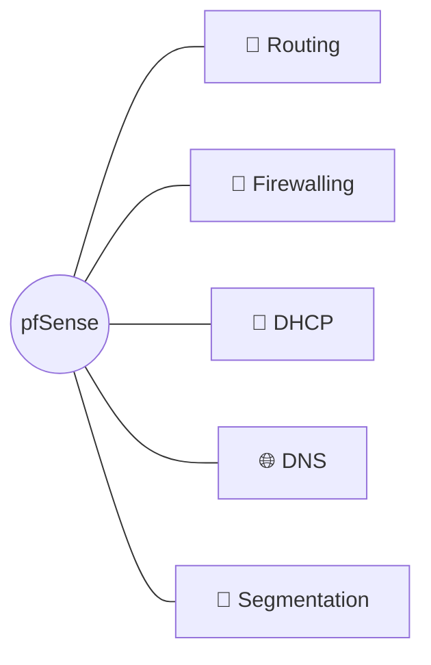
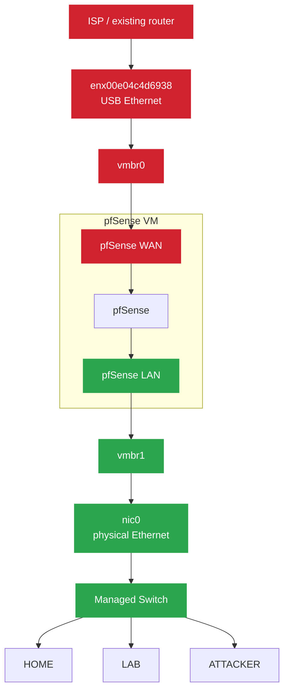
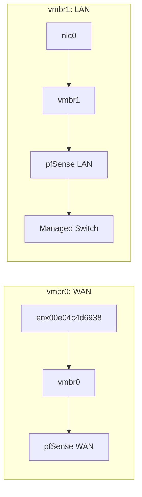
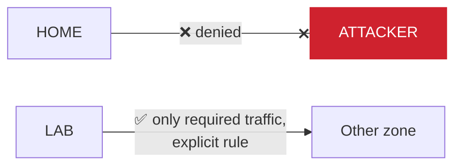

# pfSense Design

## 1. Purpose

pfSense provides routing, firewalling, DHCP, DNS, and network segmentation for the room network and cybersecurity homelab.

pfSense runs as a virtual machine on the Proxmox hypervisor.

The pfSense instance is the primary router and firewall for the network behind the Proxmox host.

## Target architecture

Our network will follow this design:

🟥 WAN side (untrusted) · 🟩 LAN side (behind the firewall)

## 2. Virtualization

|Component|Configuration|
|---|---|
|Hypervisor|Proxmox VE|
|VM|pfsense-01|
|CPU|2 cores|
|RAM|4 GB|
|Storage|20 GB|
|WAN|vmbr0|
|LAN|vmbr1|

## 3. Physical Interfaces

| Interface | Type              | Proxmox Role |
| --------- | ----------------- | ------------ |
| WAN_NIC   | USB Ethernet      | WAN          |
| LAN_NIC   | Physical Ethernet | LAN          |

## 4. Proxmox Bridges

### vmbr0: WAN

The existing Proxmox management network currently uses this bridge.

| Example | Value |
|---|---|
| Proxmox management address | `192.168.0.20/24` |
| Gateway | `192.168.0.1` |

### vmbr1: LAN

This bridge will provide pfSense with access to the internal room network.

## 5. Network Segmentation

> [!WARNING] Superseded
> The VLAN plan below (HOME/LAB-USERS/LAB-SERVERS/ATTACKER/IOT) was the original design and was never built. What's actually deployed uses different numbers, names, and subnets: see [Homelab - Inventory](<../1 - Infrastructure/Homelab - Inventory.md>) §2, which is authoritative. Kept here only for the original rationale (deny-by-default, isolate attacker traffic from home traffic); don't use this table for real IPs.

The internal network will be divided into separate security zones using VLANs.

|VLAN|Name|Subnet|Purpose|
|---|---|---|---|
|10|HOME|192.168.10.0/24|Personal devices|
|20|LAB-USERS|10.10.10.0/24|Windows clients|
|30|LAB-SERVERS|10.10.20.0/24|Servers / Active Directory|
|40|ATTACKER|10.10.40.0/24|Security testing|
|50|IOT|192.168.50.0/24|IoT devices|

## 6. Security Objective

The home network and cybersecurity lab must remain logically separated.

The ATTACKER network is intentionally isolated from the HOME network.

Firewall rules will control communication between VLANs.

The default security posture will be deny-by-default, with only required traffic explicitly permitted.

Deny-by-default: nothing crosses zones unless a rule explicitly allows it.
