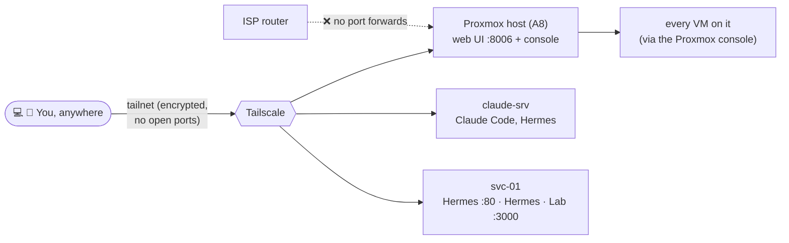

# Tailscale

## Current State



Installed on the Proxmox host (A8) and two containers that need their own access (claude-srv, svc-01). Gives remote access to the Proxmox web UI and console (and by extension every VM on it) over a private overlay network, with no ports forwarded on the router.

| Setting | Value |
|---|---|
| Nodes | `proxmox-a8` `100.121.216.124`, `claude-srv` `100.88.249.127`, `svc-01` `100.102.216.72`, plus Clyde's laptop and iPhone |
| Dashboards over Tailscale | Hermes `http://100.102.216.72` (or `http://svc-01` with MagicDNS), Hermes · Lab `http://100.102.216.72:3000` |
| Access URL | `https://<tailscale-ip>:8006` (replaces LAN access at `https://192.168.0.20:8006`) |
| Auto-start | `tailscaled` enabled via systemd |

> [!NOTE] Containers on the tailnet
> Unprivileged LXCs need `/dev/net/tun` passed through (`pct set <ctid> -dev0 /dev/net/tun`, then reboot the CT) before Tailscale can run in kernel mode. Done for CT 105 (claude-srv) and CT 106 (svc-01).

> [!NOTE] Why host-only for the VMs
> Proxmox's own console/VM management already reaches every VM, so per-VM Tailscale isn't needed yet. Revisit when a VM needs to be reachable independently of Proxmox (e.g. simulating an internet-facing endpoint, or access when Proxmox itself is down).

### Install / enable (for rebuilds)
```bash
curl -fsSL https://tailscale.com/install.sh | sh
systemctl enable --now tailscaled
tailscale up
```
Authenticate via the login URL printed by `tailscale up`. Verify with `tailscale status` and `tailscale ip -4`.

## Change Log

### Undated: initial install
- Installed and authenticated on A8. Exact date not recorded: add it here if you find it in shell history or the Tailscale admin console's device list.


### 2026-09-25: svc-01 joined

- Goal: reach the Hermes dashboards from the phone away from home without exposing anything publicly. Tailscale only: no router port forward, no pfSense WAN rule.
- Clyde: `pct set 106 -dev0 /dev/net/tun`, `pct reboot 106`, installed Tailscale on svc-01, `tailscale up --hostname svc-01 --accept-dns=false` (keeps svc-01 and Docker on the lab DNS). IP `100.102.216.72`.
- Homepage rejects unknown Host headers: `HOMEPAGE_ALLOWED_HOSTS` now `10.10.10.30:3000,100.102.216.72:3000,svc-01:3000`.
- **Verification (from claude-srv over the tailnet):** Hermes `/` and `/data/dashboard.json` 200, Hermes · Lab 200 by IP and by `svc-01` name, LAN address still 200.
- **Still LAN-only from the phone:** links inside the dashboards to `10.10.10.x` (pfSense, Proxmox lab, DC01/WIN11-01 consoles) need a subnet router for `10.10.10.0/24`.

