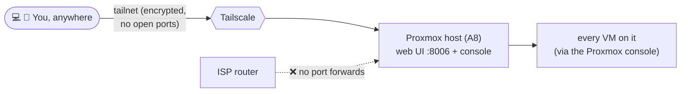

# Tailscale

## Current State



Installed on the Proxmox host (A8) only, not inside any VM. Gives remote access to the Proxmox web UI and console (and by extension every VM on it) over a private overlay network, with no ports forwarded on the router.

| Setting | Value |
|---|---|
| Installed on | Proxmox host (A8) only |
| Tailscale IP | `100.x.x.x`: ⚠️ actual address not recorded here; run `tailscale ip -4` on A8 and fill in |
| Access URL | `https://<tailscale-ip>:8006` (replaces LAN access at `https://192.168.0.20:8006`) |
| Auto-start | `tailscaled` enabled via systemd |

> [!NOTE] Why host-only for now
> Proxmox's own console/VM management already reaches every VM, so per-VM Tailscale isn't needed yet. Revisit when a VM needs to be reachable independently of Proxmox (e.g. simulating an internet-facing endpoint, or access when Proxmox itself is down).

### Install / enable (for rebuilds)
```bash
curl -fsSL https://tailscale.com/install.sh | sh
systemctl enable --now tailscaled
tailscale up
```
Authenticate via the login URL printed by `tailscale up`. Verify with `tailscale status` and `tailscale ip -4`.

## Change Log

### Undated: initial install
- Installed and authenticated on A8. Exact date not recorded: add it here if you find it in shell history or the Tailscale admin console's device list.
