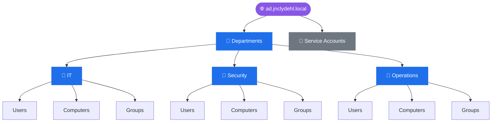
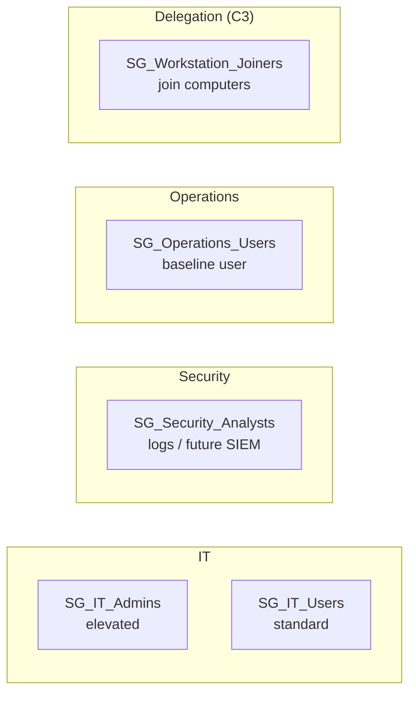
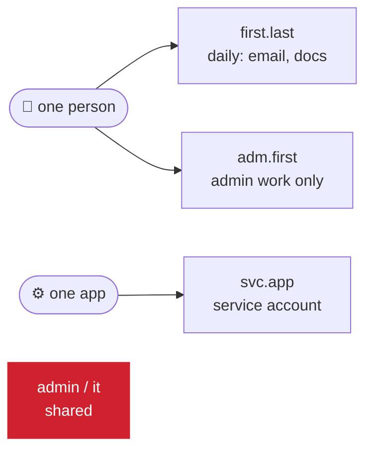

# Active Directory Administration

Related: [[Active Directory Design]] · [[DC01]] · [[WIN11-01]]

## Current State (as of 2026-09-24)

> [!NOTE] Rebuilt 2026-09-24
> The domain was found empty on 2026-09-24 (the 2026-09-16 OUs and groups were gone). Everything below was rebuilt that day and verified over LDAP.

### OU Structure

Every department gets the same three sub-OUs: Users, Computers, Groups.

> [!todo] Screenshot pending
> Referenced screenshot `aduc-ou-tree-2026-09-16.png` was never actually saved to the attachments folder: add it or drop this callout.

### Security Groups

| Group | Type/Scope | Purpose | Members |
|---|---|---|---|
| SG_IT_Admins | Security, Global | Elevated permissions within IT's scope (no rights granted yet) | `adm.clyde` |
| SG_IT_Users | Security, Global | Standard IT department users | `marc.puig` |
| SG_Security_Analysts | Security, Global | Access to logs/monitoring (future SIEM) | `laura.vidal` |
| SG_Operations_Users | Security, Global | Standard "regular user" baseline | `jordi.serra` |
| SG_Workstation_Joiners | Security, Global | Delegated join-domain permission (planned for C3: delegation, not yet done) | none |

### Users

| sAMAccountName | Display name | OU | Groups | Notes |
|---|---|---|---|---|
| `marc.puig` | Marc Puig | IT/Users | SG_IT_Users | Test user |
| `laura.vidal` | Laura Vidal | Security/Users | SG_Security_Analysts | Test user |
| `jordi.serra` | Jordi Serra | Operations/Users | SG_Operations_Users | Test user, the persona behind WIN11-01 |
| `adm.clyde` | Clyde Laquindanum (Admin) | IT/Users | SG_IT_Admins | Admin account |
| `svc.claude-ro` | svc.claude-ro | Service Accounts | Domain Users only | Read-only LDAP bind for Claude on `claude-srv` (AD checkpoints). Password never expires. Simple bind on 389, cleartext on the LAN until LDAPS exists |

### Computers

| Computer | OU |
|---|---|
| DC01 | Domain Controllers |
| WIN11-01 | Operations/Computers |

### Naming Conventions
- OUs: `<Department> → Users / Computers / Groups`
- Groups: `SG_<Department>_<Function>`
- Accounts (apply to AD **and** local Linux/Windows accounts, all lowercase, max 20 chars to fit `sAMAccountName`):

| Type | Pattern | Example | Rule |
|---|---|---|---|
| Daily user | `<first>.<last>` | `marc.puig` | Email, browsing, docs. Never holds admin rights. |
| Admin | `adm.<first>` | `adm.clyde` | Privileged work only. Not used for email or browsing. Display name ends in `(Admin)`. |
| Service | `svc.<app>[-<scope>]` | `svc.claude-ro` | One per app, never a person. Lives in the `Service Accounts` OU. |
| Generic/shared | not allowed | `admin`, `it` | No accountability. |

> [!WARNING] Outlier
> `svc-01` still has the local account `adm-jnclyde` from the earlier hyphen convention. Rename it to `adm.clyde` before `svc-01` joins the domain (`realmd`/`sssd`), so one person has one admin name everywhere.

Servers that only get administered (e.g. `svc-01`) carry the admin account only.

> [!info] Why this structure
> Departments chosen (IT / Security / Operations) instead of a generic business template map to real permission narratives relevant to a security career path. See [[Active Directory Design]] for full rationale.

---

## Change Log

### 2026-09-16: C1, OU structure and security groups
**Changed:**
- Created `Departments` OU → IT / Security / Operations, each with Users/Computers/Groups sub-OUs
- Created `Service Accounts` OU at root (reserved for C2)
- Created groups: SG_IT_Admins, SG_IT_Users, SG_Security_Analysts, SG_Operations_Users, SG_Workstation_Joiners

**Verification lab:** never completed. Superseded by the 2026-09-24 rebuild below.

**Issues:** these objects were no longer in the domain by 2026-09-24.

---

### 2026-09-24: Account naming convention
**Changed:** Added daily / admin / service account patterns under Naming Conventions.
**Why:** Separate admin accounts keep stolen daily credentials from carrying admin rights (tiered admin model). One convention across AD and Linux keeps a later `realmd`/`sssd` join clean.
**Applied:** `adm-jnclyde` on `svc-01`.
**Trade-off accepted:** handle-based usernames are guessable (password spraying risk). Mitigated later by lockout policy (C4) and monitoring, not by obscure usernames.

---

### 2026-09-24: C1 rebuilt and verified
**Changed:**
- Recreated the full OU tree (14 OUs) and the 5 `SG_` groups (Security, Global)
- Created test users `marc.puig`, `laura.vidal`, `jordi.serra`, admin `adm.clyde`, service account `svc.claude-ro`, each added to its group
- Renamed the client `DESKTOP-20NK59U` to `WIN11-01` (it was joined under its install name) and moved it from `CN=Computers` to `Operations/Computers`
- Deleted stale DNS A records `win11-01` (left by the incident below) and `desktop-20nk59u`

**Why:** domain was found empty. `WIN11-01` has to be in an OU for C4 GPOs to reach it (the default `Computers` container can't take GPO links).

**Verification lab:**
- [x] Test user created inside each department's Users OU
- [x] Correct OU placement and group membership confirmed (LDAP query as `svc.claude-ro`)
- [x] Object moved between OUs and update confirmed (`WIN11-01` into `Operations/Computers`)

**Issues:** first names were created with the ADUC Initials field filled (`Marc MP. Puig`), which leaks into both `displayName` and the CN. Fixed with Rename (F2), which is the only thing that changes the CN. DC01 was renamed by mistake during the client rename, see [[Incidents Log]].

---

### 2026-09-24: Naming convention changed to dots
**Changed:** `adm-<handle>` / `svc-<app>` / `<handle>` replaced by `adm.<first>` / `svc.<app>[-<scope>]` / `<first>.<last>`.
**Why:** accounts were created in AD with dots; Clyde prefers that pattern over the hyphen one, so the doc follows the directory.
**Open:** `adm-jnclyde` on `svc-01` still uses the old pattern (see Outlier note above).

