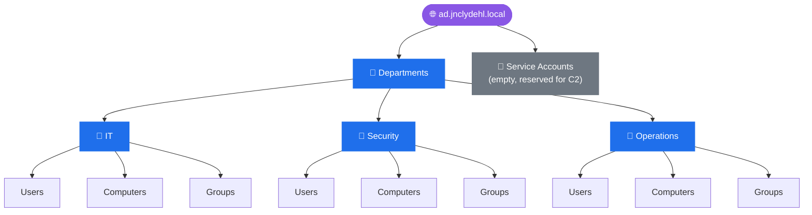
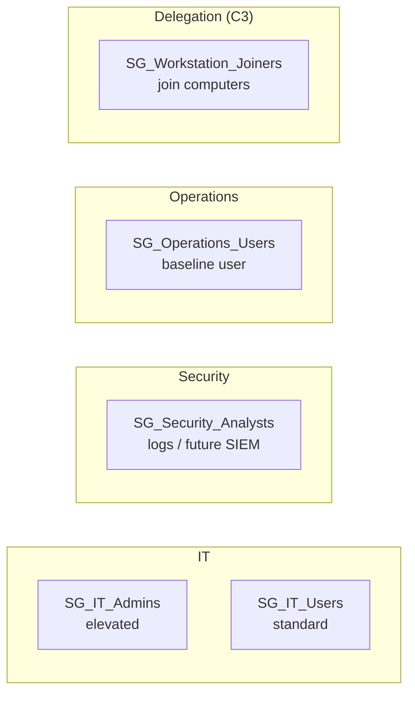
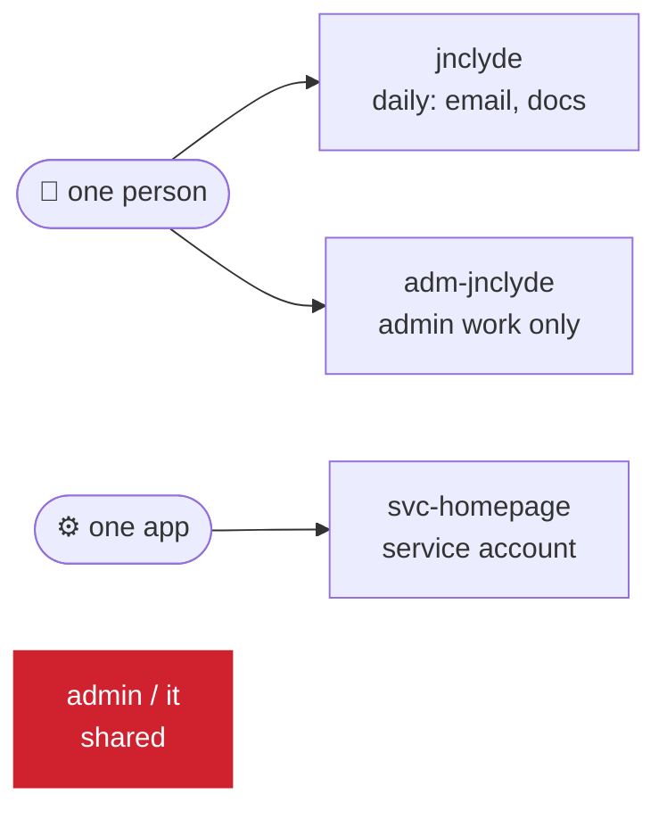

# Active Directory Administration

Related: [[Active Directory Design]] · [[DC01]] · [[WIN11-01]]

## Current State (as of 2026-09-16)

### OU Structure

Every department gets the same three sub-OUs: Users, Computers, Groups.

> [!todo] Screenshot pending
> Referenced screenshot `aduc-ou-tree-2026-09-16.png` was never actually saved to the attachments folder: add it or drop this callout.

### Security Groups

| Group | Type/Scope | Purpose | Members |
|---|---|---|---|
| SG_IT_Admins | Security, Global | Elevated permissions within IT's scope | *pendiente* |
| SG_IT_Users | Security, Global | Standard IT department users | *pendiente* |
| SG_Security_Analysts | Security, Global | Access to logs/monitoring (future SIEM) | *pendiente* |
| SG_Operations_Users | Security, Global | Standard "regular user" baseline | *pendiente* |
| SG_Workstation_Joiners | Security, Global | Delegated join-domain permission (planned for C3: delegation, not yet done) | *pendiente* |

### Naming Conventions
- OUs: `<Department> → Users / Computers / Groups`
- Groups: `SG_<Department>_<Function>`
- Accounts (apply to AD **and** local Linux/Windows accounts, all lowercase, max 20 chars to fit `sAMAccountName`):

| Type | Pattern | Example | Rule |
|---|---|---|---|
| Daily user | `<handle>` | `jnclyde` | Email, browsing, docs. Never holds admin rights. |
| Admin | `adm-<daily name>` | `adm-jnclyde` | Privileged work only. Not used for email or browsing. |
| Service | `svc-<app>` | `svc-homepage` | One per app, never a person. Lives in the `Service Accounts` OU. |
| Generic/shared | not allowed | `admin`, `it` | No accountability. |

Servers that only get administered (e.g. `svc-01`) carry the admin account only.

> [!info] Why this structure
> Departments chosen (IT / Security / Operations) instead of a generic business template map to real permission narratives relevant to a security career path. See [[Active Directory Design]] for full rationale.

---

## Change Log

### 2026-09-16: C1, OU structure and security groups
**Changed:**
- Created `Departments` OU → IT / Security / Operations, each with Users/Computers/Groups sub-OUs
- Created `Service Accounts` OU at root (reserved for C2)
- Created groups: SG_IT_Admins, SG_IT_Users, SG_Security_Analysts, SG_Operations_Users, SG_Workstation_Joiners

**Verification lab:**
- [ ] Test user created inside each department's Users OU
- [ ] Confirmed correct OU placement in ADUC
- [ ] Moved a test user between OUs, confirmed update

**Issues:** 

---

### 2026-09-24: Account naming convention
**Changed:** Added daily / admin / service account patterns under Naming Conventions.
**Why:** Separate admin accounts keep stolen daily credentials from carrying admin rights (tiered admin model). One convention across AD and Linux keeps a later `realmd`/`sssd` join clean.
**Applied:** `adm-jnclyde` on `svc-01`.
**Trade-off accepted:** handle-based usernames are guessable (password spraying risk). Mitigated later by lockout policy (C4) and monitoring, not by obscure usernames.

---

