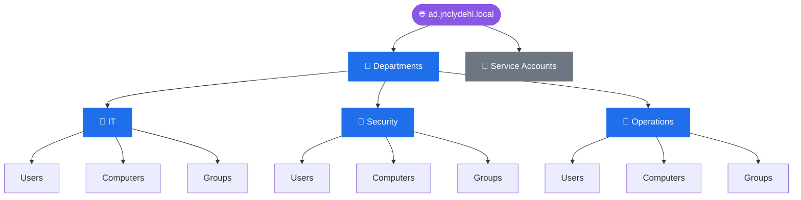
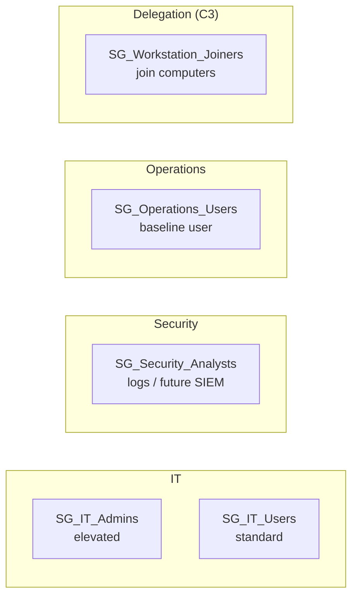
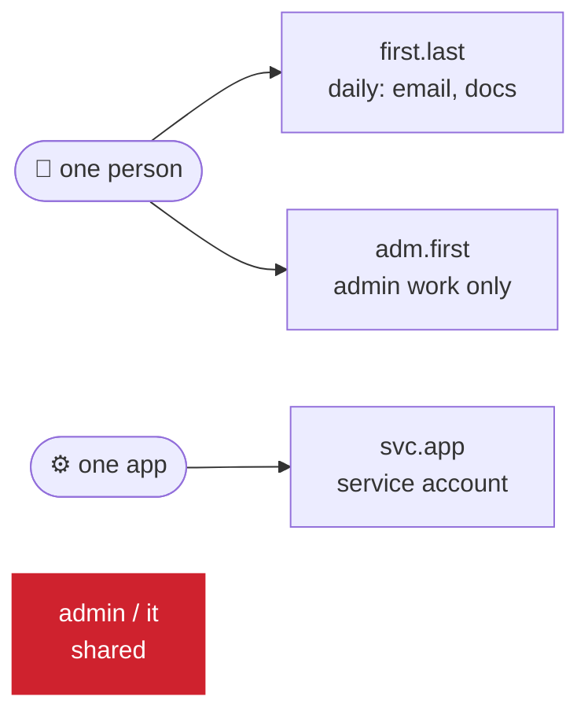

# Active Directory Administration

Related: [[Active Directory Design]] · [[DC01]] · [[WIN11-01]]

## Current State (as of 2026-09-24)

> [!NOTE] Rebuilt 2026-09-24
> The domain was found empty on 2026-09-24 (the 2026-09-16 OUs and groups were gone). Everything below was rebuilt that day and verified over LDAP.

### OU Structure

```mermaid
flowchart TB
    root(["🌐 ad.jnclydehl.local"]) --> dep["📁 Departments"]
    root --> svc["📁 Service Accounts"]
    dep --> it["📁 IT"]
    dep --> sec["📁 Security"]
    dep --> ops["📁 Operations"]
    it --> itu["Users"] & itc["Computers"] & itg["Groups"]
    sec --> secu["Users"] & secc["Computers"] & secg["Groups"]
    ops --> opsu["Users"] & opsc["Computers"] & opsg["Groups"]
    classDef r fill:#8957e5,stroke:#8957e5,color:#fff
    classDef d fill:#1f6feb,stroke:#1f6feb,color:#fff
    classDef e fill:#6e7781,stroke:#6e7781,color:#fff
    class root r
    class dep,it,sec,ops d
    class svc e
```

Every department gets the same three sub-OUs: Users, Computers, Groups.

### Security Groups

```mermaid
flowchart LR
    subgraph IT
        a["SG_IT_Admins<br/>elevated"]
        b["SG_IT_Users<br/>standard"]
    end
    subgraph Security
        c["SG_Security_Analysts<br/>logs / future SIEM"]
    end
    subgraph Operations
        d["SG_Operations_Users<br/>baseline user"]
    end
    subgraph Delegation["Delegation (C3)"]
        e["SG_Workstation_Joiners<br/>join computers"]
    end
```
| Group | Type/Scope | Purpose | Members |
|---|---|---|---|
| SG_IT_Admins | Security, Global | Elevated permissions within IT's scope (no rights granted yet) | `adm.clyde` |
| SG_IT_Users | Security, Global | Standard IT department users | `marc.puig` |
| SG_Security_Analysts | Security, Global | Access to logs/monitoring (future SIEM) | `laura.vidal` |
| SG_Operations_Users | Security, Global | Standard "regular user" baseline | `jordi.serra` |
| SG_Workstation_Joiners | Security, Global | Delegated join-domain permission (planned for C3: delegation, not yet done) | none |

### Users

| sAMAccountName | Display name | OU | Groups | Notes |
|---|---|---|---|---|
| `marc.puig` | Marc Puig | IT/Users | SG_IT_Users | Test user |
| `laura.vidal` | Laura Vidal | Security/Users | SG_Security_Analysts | Test user |
| `jordi.serra` | Jordi Serra | Operations/Users | SG_Operations_Users | Test user, the persona behind WIN11-01 |
| `adm.clyde` | Clyde Laquindanum (Admin) | IT/Users | SG_IT_Admins | Admin account |
| `svc.claude-ro` | svc.claude-ro | Service Accounts | Domain Users only | Read-only LDAP bind for Claude on `claude-srv` (AD checkpoints). Password never expires. Simple bind on 389, cleartext on the LAN until LDAPS exists |

### Computers

| Computer | OU |
|---|---|
| DC01 | Domain Controllers |
| WIN11-01 | Operations/Computers |

### Naming Conventions
- OUs: `<Department> → Users / Computers / Groups`
- Groups: `SG_<Department>_<Function>`
- Accounts (apply to AD **and** local Linux/Windows accounts, all lowercase, max 20 chars to fit `sAMAccountName`):

| Type | Pattern | Example | Rule |
|---|---|---|---|
| Daily user | `<first>.<last>` | `marc.puig` | Email, browsing, docs. Never holds admin rights. |
| Admin | `adm.<first>` | `adm.clyde` | Privileged work only. Not used for email or browsing. Display name ends in `(Admin)`. |
| Service | `svc.<app>[-<scope>]` | `svc.claude-ro` | One per app, never a person. Lives in the `Service Accounts` OU. |
| Generic/shared | not allowed | `admin`, `it` | No accountability. |

```mermaid
flowchart LR
    p(["👤 one person"]) --> d["first.last<br/>daily: email, docs"]
    p --> a["adm.first<br/>admin work only"]
    app(["⚙️ one app"]) --> s["svc.app<br/>service account"]
    x["admin / it<br/>shared"]:::bad
    classDef bad fill:#cf222e,stroke:#cf222e,color:#fff
```

> [!WARNING] Outlier
> `svc-01` still has the local account `adm-jnclyde` from the earlier hyphen convention. Rename it to `adm.clyde` before `svc-01` joins the domain (`realmd`/`sssd`), so one person has one admin name everywhere.

Servers that only get administered (e.g. `svc-01`) carry the admin account only.

> [!info] Why this structure
> Departments chosen (IT / Security / Operations) instead of a generic business template map to real permission narratives relevant to a security career path. See [[Active Directory Design]] for full rationale.

### Group Policy

Five GPOs, enforced against domain accounts and against [[WIN11-01]] depending on OU placement.

| GPO | Linked to | Settings | Why | Verified with |
|---|---|---|---|---|
| Default Domain Policy | Domain root (`DC=ad,DC=jnclydehl,DC=local`) | Password: min length 14, history 24, max age 365 days, min age 1 day, complexity on. Lockout: threshold 5, duration 15 min, observation window 15 min | Account policy for domain accounts is only read from the GPO linked at the domain root | `Get-ADDefaultDomainPasswordPolicy` on DC01, lockout test against `jordi.serra` (LockedOut True), `Unlock-ADAccount` to clear |
| GPO-Workstation-Baseline | Departments | Firewall on for Domain, Private and Public profiles (inbound blocked by default), screen lock timeout 600 seconds, SMBv1 disabled (Preference registry item) | A single link on a parent OU reaches every child OU beneath it | `gpresult` applied GPO list on WIN11-01, `Get-NetFirewallProfile`, screen lock timeout value, `EnableSMB1Protocol` False |
| GPO-Local-Admins | Departments | SG_IT_Admins added to the local Administrators group (Preference) | People are placed in groups, groups are placed on resources, nobody is named directly; Preferences are additive | `net localgroup Administrators` on WIN11-01 (SG_IT_Admins listed), elevated prompt succeeded for `adm.clyde`, failed for `marc.puig` |
| GPO-Operations-Restrictions | Operations/Users | Control Panel and Settings blocked | User-side settings follow the user object; scope is enforced by the OU the user account lives in | `gpresult` and interactive test as `jordi.serra` (GPO listed, Settings blocked) versus `laura.vidal` (GPO absent, Settings opens normally) |
| GPO-Security-PSLogging | Security/Computers | PowerShell script block logging enabled | Computer-side scope follows the computer object, so moving it between OUs changes what applies | Negative test with WIN11-01 in Operations (GPO absent), positive test after moving it into Security/Computers (GPO listed, `EnableScriptBlockLogging` = 1, event ID 4104 captured), negative test again after moving it back (registry key removed) |

**Domain password and lockout policy, before and after**

| Setting | Before (AD DS default) | After |
|---|---|---|
| Minimum password length | 7 | 14 |
| Password history count | 24 | 24 (unchanged) |
| Maximum password age | 42 days | 365 days |
| Minimum password age | 1 day | 1 day (unchanged) |
| Complexity enabled | True | True (unchanged) |
| Lockout threshold | 0 (no lockout) | 5 invalid attempts |
| Lockout duration | 30 minutes | 15 minutes |
| Lockout observation window | 30 minutes | 15 minutes |

![[s0c-1.png]]

All five GPOs are backed up (one folder per GPO) to `C:\GPOBackup` on DC01, then copied off DC01.

---

## Change Log

### 2026-09-16: C1, OU structure and security groups
**Changed:**
- Created `Departments` OU → IT / Security / Operations, each with Users/Computers/Groups sub-OUs
- Created `Service Accounts` OU at root (reserved for C2)
- Created groups: SG_IT_Admins, SG_IT_Users, SG_Security_Analysts, SG_Operations_Users, SG_Workstation_Joiners

**Verification lab:** never completed. Superseded by the 2026-09-24 rebuild below.

**Issues:** these objects were no longer in the domain by 2026-09-24.

---

### 2026-09-24: Account naming convention
**Changed:** Added daily / admin / service account patterns under Naming Conventions.
**Why:** Separate admin accounts keep stolen daily credentials from carrying admin rights (tiered admin model). One convention across AD and Linux keeps a later `realmd`/`sssd` join clean.
**Applied:** `adm-jnclyde` on `svc-01`.
**Trade-off accepted:** handle-based usernames are guessable (password spraying risk). Mitigated later by lockout policy (C4) and monitoring, not by obscure usernames.

---

### 2026-09-24: C1 rebuilt and verified
**Changed:**
- Recreated the full OU tree (14 OUs) and the 5 `SG_` groups (Security, Global)
- Created test users `marc.puig`, `laura.vidal`, `jordi.serra`, admin `adm.clyde`, service account `svc.claude-ro`, each added to its group
- Renamed the client `DESKTOP-20NK59U` to `WIN11-01` (it was joined under its install name) and moved it from `CN=Computers` to `Operations/Computers`
- Deleted stale DNS A records `win11-01` (left by the incident below) and `desktop-20nk59u`

**Why:** domain was found empty. `WIN11-01` has to be in an OU for C4 GPOs to reach it (the default `Computers` container can't take GPO links).

**Verification lab:**
- [x] Test user created inside each department's Users OU
- [x] Correct OU placement and group membership confirmed (LDAP query as `svc.claude-ro`)
- [x] Object moved between OUs and update confirmed (`WIN11-01` into `Operations/Computers`)

**Issues:** first names were created with the ADUC Initials field filled (`Marc MP. Puig`), which leaks into both `displayName` and the CN. Fixed with Rename (F2), which is the only thing that changes the CN. DC01 was renamed by mistake during the client rename, see [[Incidents Log]].

---

### 2026-09-24: Naming convention changed to dots
**Changed:** `adm-<handle>` / `svc-<app>` / `<handle>` replaced by `adm.<first>` / `svc.<app>[-<scope>]` / `<first>.<last>`.
**Why:** accounts were created in AD with dots; Clyde prefers that pattern over the hyphen one, so the doc follows the directory.
**Open:** `adm-jnclyde` on `svc-01` still uses the old pattern (see Outlier note above).

---

### 2026-09-28: C4, Group Policy baseline
**Changed:** Tightened Default Domain Policy at the domain root (password and lockout settings). Added four scoped GPOs: GPO-Workstation-Baseline and GPO-Local-Admins linked to Departments (parent-OU inheritance reaches every child), GPO-Operations-Restrictions linked to Operations/Users (user-object scope), GPO-Security-PSLogging linked to Security/Computers (computer-object scope).

**Why:** turn the OU design into an enforced baseline, and demonstrate for each GPO why it is linked where it is: account policy only at the root, inheritance from a parent OU, user scope versus computer scope, groups placed on resources instead of named accounts.

**Verification lab:**
- [x] Each GPO tested from both sides on [[WIN11-01]]: applies where expected, does not apply where it should not (GPO-Operations-Restrictions against `jordi.serra` vs `laura.vidal`; GPO-Security-PSLogging with WIN11-01 moved into Security/Computers then back to Operations/Computers)
- [x] `Get-GPInheritance` on the Operations OU: GPO-Workstation-Baseline, GPO-Local-Admins and Default Domain Policy inherited
- [x] `gpresult /h` HTML report on WIN11-01
- [x] Cross-checked over LDAP as `svc.claude-ro` (read-only): all 5 GPO objects exist under `CN=Policies,CN=System`, and `gPLink` on each target OU (Departments, Operations/Users, Security/Computers, domain root) points at exactly the GUID the table above lists. WIN11-01's current `distinguishedName` confirmed back in `OU=Computers,OU=Operations,OU=Departments` (post negative-retest state)
- [ ] Domain password policy itself not re-verified over LDAP for this entry: already proved directly with `Get-ADDefaultDomainPasswordPolicy` (before screenshot: `s0c-1.png`, see the table above)

**Issues:**
- `gpresult /r /scope computer` returned Access Denied from a non-elevated PowerShell session; computer-scope RSOP data needs an elevated session. Fixed by reopening PowerShell as Administrator.
- `Get-WinEvent -LogName ... -FilterHashtable @{Id=4104}` failed twice: a copy-paste line split, then `AmbiguousParameterSet` because `-LogName` and `-FilterHashtable` are separate, mutually exclusive parameter sets. Fixed by putting `LogName` as a key inside the hashtable, one line.
- `gpresult /h` report would not render in Edge (raw tags, or an open/save loop through Internet Explorer): the file had been saved with a typo'd extension (`.hmlt`), which has no browser association.

**Not evidenced / open:**
- The pasted `gpresult` Applied GPOs screenshot only shows the top of the list (the two built-in default GPOs); it does not visibly include the four custom GPOs. Worth a rescreenshot scrolled further down if this table needs a second image.
- Snapshot of the finished VM state (Proxmox) and the handoff note for the next session were not part of this write-up; those are separate from the documentation itself.

