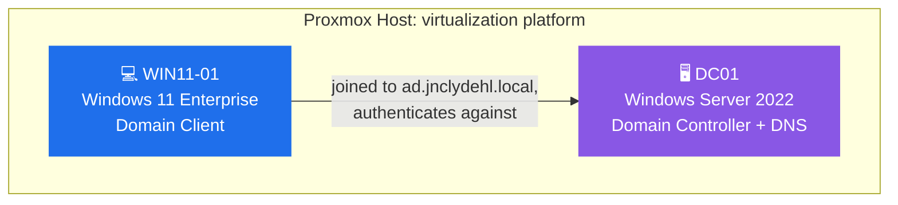
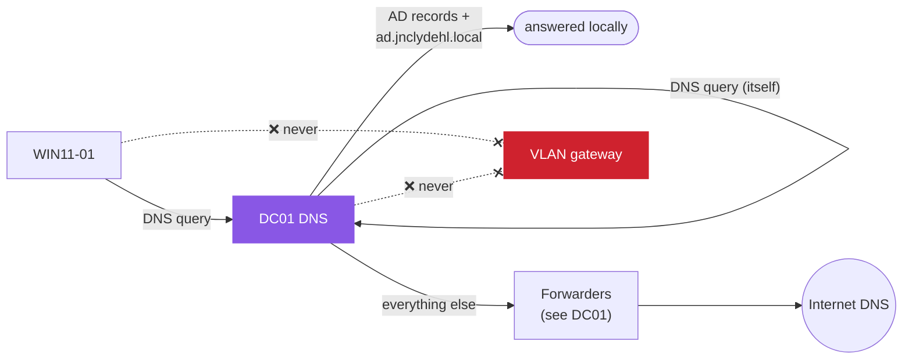
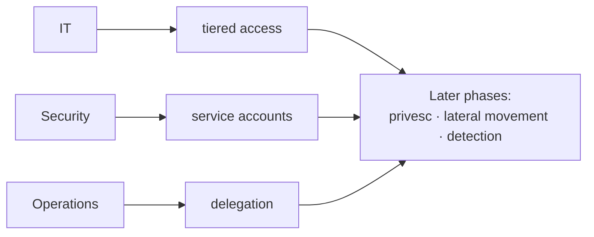

# Active Directory Design

Related: [[AD Administration]] · [[DC01]] · [[WIN11-01]] · [Homelab - Inventory](<../1 - Infrastructure/Homelab - Inventory.md>)

## Objective
Deploy and simulate a basic enterprise Active Directory environment using Windows Server 2022 and Windows 11 clients for:

- 🔐 Domain authentication
- 🌐 DNS infrastructure
- 📜 Group Policy management
- 🧪 Identity and access control testing

## Architecture

### Components

- **DC01** (Windows Server 2022) → Domain Controller + DNS
- **WIN11-01** (Windows 11 Enterprise) → Domain Client
- **Proxmox Host** → Virtualization platform

### Network placement

Both DC01 and WIN11-01 live on the **Servers VLAN (20)**. See [[pfSense Configuration]] for the VLAN plan and [Homelab - Inventory](<../1 - Infrastructure/Homelab - Inventory.md>) for current live IPs (don't duplicate exact IPs here; they drift).

> [!IMPORTANT] Design rule
> **DC01 is authoritative DNS for the domain and resolves itself.** Every domain machine, DC01 included, must use DC01 as its DNS server. DC01 does not use the VLAN gateway as DNS.

## DNS Rules (Critical)

- All domain machines MUST use DC01 as DNS
- DC01 resolves:
    - Active Directory records
    - Internal domain (`ad.jnclydehl.local`, see Domain Configuration below)
- External resolution handled via DNS forwarders (see [[DC01]] for the forwarder list)

## Domain Configuration

| Setting | Value |
|---|---|
| Domain | `ad.jnclydehl.local` |
| NetBIOS | `JNCLYDEHL` |
| Forest Type | Single Domain Forest |
| Functional Level | Windows Server 2022 |

- Domain: `ad.jnclydehl.local`, confirmed live via a direct DNS query against DC01 during the 2026-09-16 troubleshooting session (valid SOA returned). `DC01.md`'s build log says `jn.clydehl.local`, which is almost certainly a transcription error in that doc, not the real forest name. See [[DC01]].

- NetBIOS: `JNCLYDEHL`, confirmed live via `Get-ADDomain` on 2026-09-24.

## Why this structure

Departments chosen for the OU tree (IT / Security / Operations, see [[AD Administration]]) instead of a generic business template map to real permission narratives relevant to a security career path. Each department gives a plausible reason for tiered access, service accounts, and delegation scenarios that later phases (privilege escalation, lateral movement, detection) can attack and defend against.

## Proxmox Virtualization Setup

> [!NOTE] Moved to proxmox-lab
> **As of 2026-09-23, both VMs live on `proxmox-lab`, not the A8.** See [[Proxmox Lab Setup]] for the migration and current host details, and [Homelab - Inventory](<../1 - Infrastructure/Homelab - Inventory.md>) for current IPs (temporarily off VLAN 20, see there). Powered-off rollback copies of both remain on the A8. The specs below are what's actually running; don't treat this section as authoritative for network placement.

### Host Configuration
- Hypervisor: Proxmox VE, host `proxmox-lab` (was A8 before 2026-09-23)
- Storage: `local` (both hosts have `local-lvm` removed and reclaimed into `local`, see [[Proxmox Setup]] and [[Proxmox Lab Setup]])
- ISO storage: local

### VM Specifications

| | DC01 | WIN11-01 |
|---|---|---|
| OS | Windows Server 2022 | Windows 11 Enterprise |
| CPU | 2 | 4 (bumped from 2, while diagnosing lag, see [[Proxmox Lab Setup]]) |
| RAM | 6GB (bumped from 4GB 2026-09-23 for AD DS/DNS headroom; verify actually applied with `qm config 100 \| grep ^memory`) | 6GB (bumped from 4GB, same session) |
| Disk | 50GB (`ide0`, not yet moved to VirtIO) | 60GB disk (`ide0`, not yet moved to VirtIO) |
| CPU type | n/a | `x86-64-v2-AES` (was `cpu: host`, inherited from the AMD A8 build; caused visible lag once running on the lab node's Intel CPU. This was the actual fix, not the RAM/CPU bump) |

