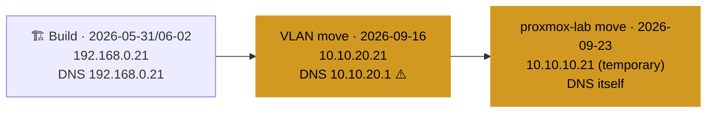

# DC01: Build Record

Related: [[Active Directory Design]] · [[AD Administration]] · [[WIN11-01]] · [Homelab - Inventory](<../1 - Infrastructure/Homelab - Inventory.md>)

> [!IMPORTANT] Frozen history record
> This is a frozen build/history record, not a live status page. **For DC01's current IP/DNS/gateway, check [Homelab - Inventory](<../1 - Infrastructure/Homelab - Inventory.md>), not the values below**, which are point-in-time and only updated via the Change Log.

Address history. ⚠️ on the VLAN step: DNS pointed at the gateway, not at itself (see below). Details of the last step: [[Proxmox Lab Setup]].

## Build (2026-05-31/06-02)
- Installed Windows Server 2022 with Desktop Experience (GUI).
- Added roles: **AD DS**, **DNS Server**.
- Promoted to the first (and only) domain controller in a new forest.
  - Root domain as typed during promotion: `jn.clydehl.local`. This does not match the domain confirmed live elsewhere (`ad.jnclydehl.local`, see note below); most likely a transcription error in this doc rather than the real forest name.
  - NetBIOS as typed: `JNCLYDEHL`.
- Configured DNS forwarders: `1.1.1.1`, `8.8.8.8`.
- Verified DNS resolution post-promotion.
- Initial network: IP `192.168.0.21`, DNS `192.168.0.21`, gateway `192.168.0.1`.

> [!NOTE] Domain/NetBIOS confirmed live (2026-09-24)
> `Get-ADDomain` on DC01 returned DNSRoot `ad.jnclydehl.local`, NetBIOSName `JNCLYDEHL`. The `jn.clydehl.local` above was a transcription error in this doc; the NetBIOS name as typed was correct. Build-time values stay as-is, since this section is history.

## Change Log

### 2026-09-16: B, Network VLAN migration
- IP changed `192.168.0.21` → `10.10.20.21`
- DNS changed `192.168.0.21` → `10.10.20.1`
- Gateway changed `192.168.0.1` → `10.10.20.1`

> [!CAUTION] Likely misconfiguration
> The DNS value above points DC01 at the VLAN gateway, not at itself. [[Active Directory Design]] states the rule explicitly: DC01 must use itself as DNS. A DC pointing at a non-AD-aware resolver for its own DNS resolution risks SRV/site lookup failures. Verify on the live box (should be `127.0.0.1` or `10.10.20.21`) and log the fix here with a new dated entry. Don't edit the line above.
