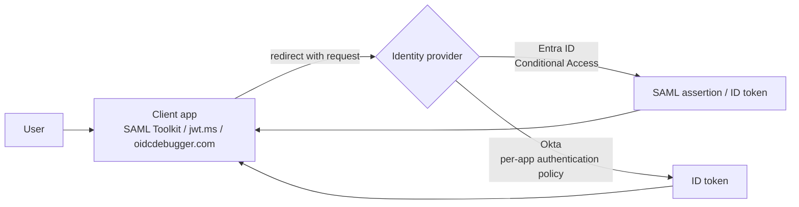

# Single Sign-On Design

Related: [[Single Sign-On]] · [[Active Directory Design]]

Architecture and rationale for the two identity providers used in the lab. Build values (URLs, names, policy settings) are in [[Single Sign-On]].

Flow: the client sends the user to the IdP, the IdP checks policy (MFA), then returns a signed assertion or token to the registered redirect URI.

## Decisions

- **Two IdPs on purpose.** Entra covers the Microsoft path (SC-300, AZ-104). Okta is the other common workforce IdP, so the same concepts are practiced on both consoles.
- **Okta on the Integrator Free Plan.** Free and not time-limited, and it includes Adaptive MFA. The 30-day trial would expire before later modules. The AD agent is not confirmed on this plan, so on-prem AD sync is not attempted.
- **OIDC for the Okta half, not SAML.** The planned public SAML test service (samltest.id) lost its domain and now redirects visitors to ad sites. OIDC needs only a redirect URI, and oidcdebugger.com is a live public client. SAML is still covered on the Entra side.
- **Pilot groups, not org-wide.** MFA rules are scoped to `SG_Entra_Pilot` and `SG_Okta_Pilot`, so a bad rule cannot lock out the admin accounts.
- **Policy per app.** In Okta the MFA rule lives in a dedicated policy attached to the app. Signing in at the plain Okta dashboard uses a different policy, so tests must start from the client.

## Entra vs Okta, same kind of task

| Topic | Entra | Okta |
|---|---|---|
| Where apps live | Enterprise applications (SAML) and App registrations (OIDC), two places | Applications > Create App Integration, protocol picked in the wizard |
| Access control | Conditional Access (CA001) scoped to a group | Authentication policy attached per app, rules scoped to a group |
| SAML flow | SP-initiated needs a Sign on URL, IdP-initiated via My Apps | Not built, module moved to OIDC (see Change Log) |
| OIDC flow | Client-initiated via hand-built authorize URL, token decoded at jwt.ms | Client-initiated via oidcdebugger.com, default response type is `code`, `id_token` must be chosen |
| Failure diagnosis | On-screen error pages, sign-in logs not used | System Log gives the exact policy or enrollment reason |
