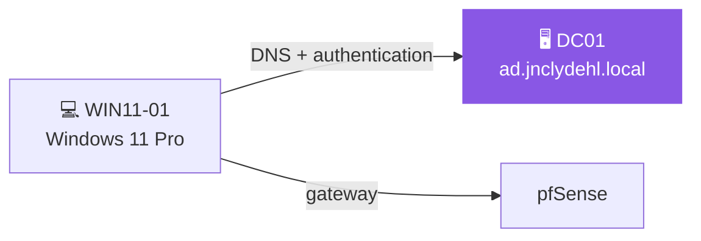
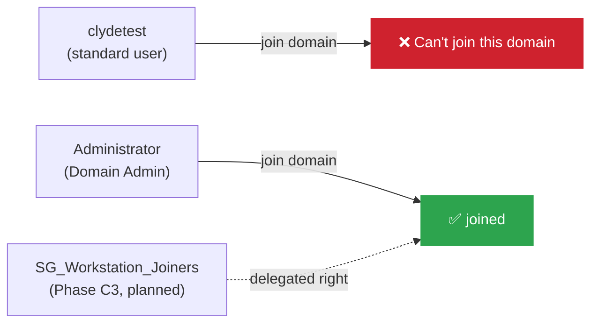

# WIN11-01

> [!NOTE] Hostname
> Until 2026-09-24 the machine's real hostname was `DESKTOP-20NK59U` (it was joined under its install name). Renamed to `WIN11-01` that day; AD object in `Operations/Computers`. See Change Log.

We will now create the client PC which we will use to join to the domain and do some testing and AD labs.

## VM Specs (Proxmox)
- Host: `proxmox-lab` (moved from A8 2026-09-23, see [[Proxmox Lab Setup]])
- vCPUs: 4 (bumped from 2 while diagnosing lag post-migration)
- RAM: 6GB (bumped from 4GB, same session)
- CPU type: `x86-64-v2-AES` (was `cpu: host` from the original AMD A8 build; this mismatch, not RAM/CPU count, was the actual cause of post-migration lag on the Intel lab node)
- Disk: 64GB (`ide0`, not yet moved to VirtIO)
- BIOS: OVMF (UEFI), required for Windows 11
- TPM: 2.0 (added via TPM State device), required for Windows 11
- Network: `vmbr0`. **Design target is VLAN Tag 20 (Servers)**, but the lab node has no VLAN trunk to the A8 yet, so this is currently untagged, see [[Proxmox Lab Setup]] and [Homelab - Inventory](<../1 - Infrastructure/Homelab - Inventory.md>)

## Installation Notes
- Edition: Windows 11 Pro (required for domain join: Home cannot join AD)
- Local account used during setup (bypassed Microsoft account requirement via 
  Shift+F10 → oobe\bypassnro at OOBE screen)

## Network Configuration

| | Design target (VLAN 20) | Current, temporary (Legacy LAN) |
|---|---|---|
| IP | `10.10.20.22` | `10.10.10.22` |
| Gateway | `10.10.20.1` | `10.10.10.1` |
| DNS | `10.10.20.21` (DC01) | `10.10.10.21` (DC01) |
| How set | pfSense DHCP static mapping | static, in Windows |

**Design target** (VLAN 20, once the lab node has a trunk, see [[Proxmox Lab Setup]]):
- IP: 10.10.20.22 (static via pfSense DHCP mapping, SERVERS VLAN)
- Gateway: 10.10.20.1
- DNS: 10.10.20.21 (DC01)

**Current, temporary** (Legacy LAN, since the 2026-09-23 migration to `proxmox-lab`):
- IP: 10.10.10.22 (manually static, set directly in Windows)
- Gateway: 10.10.10.1
- DNS: 10.10.10.21 (DC01, also temporarily on Legacy LAN)
- The VLAN 20 DHCP mapping above was left in place, not deleted: revert to it once the switch trunk exists.

## Domain Join
- Domain:`ad.jnclydehl.local`
- Joined on: 2026-09-11, using `Administrator` account
- Verified: `whoami /fqdn` → `AD\Administrator` ✅
- Confirmation:

## Known Issues / Troubleshooting

- **Standard domain user cannot join computers to the domain by default.** Attempted join with `clydetest` (a standard User account, not Domain Admin), failed with "Can't join this domain." 

> [!NOTE] Expected behaviour
> This is expected AD behavior: joining computers to a domain requires Domain Admin rights or explicit delegation ("Add workstations to domain"). Revisit this in Fase C3 (delegation) to grant this permission to a specific group instead of using Administrator for everything.

## Change Log

### 2026-09-24: Renamed, DNS fixed, moved to OU
- **Changed:** hostname `DESKTOP-20NK59U` → `WIN11-01`. DNS server `10.10.20.21` → `10.10.10.21` (was never updated during the 2026-09-23 migration, so the table above was wrong until now). AD object moved from `CN=Computers` to `OU=Computers,OU=Operations,OU=Departments`.
- **Why:** docs already called it WIN11-01; GPOs (C4) need it in an OU; the stale DNS server made it unable to find the domain.
- **Verification:** `nltest /dsgetdc:ad.jnclydehl.local` returns DC01; AD object `WIN11-01$` in `Operations/Computers`; `win11-01` resolves to `10.10.10.22`. Full story in [[Incidents Log]].

