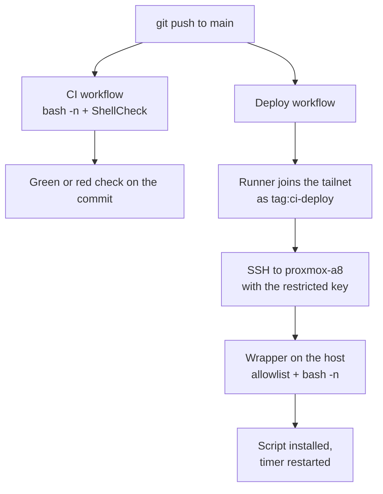

> [!NOTE] At a glance
> Push a script to `main` and it lands on `proxmox-a8` on its own, through a locked-down path that can do exactly one thing. Operating it: [[Automation Administration]]. The scripts it deploys: [[Proxmox Administration]].

# Current State (as of 2026-09-22)

## Why it exists

Watchdog scripts used to live only on the Proxmox host and were edited by hand. Fixes got lost, and nothing checked them. Now this repo is the source of truth: a change is written here, checked, and deployed without copying anything by hand.

## How it works

> [!IMPORTANT]
> CI and Deploy start at the same time. Deploy does **not** wait for CI. A ShellCheck warning shows a red check but does not stop the deploy. The `bash -n` checks in `deploy.sh` and in the host wrapper are what block a broken script.

## What is where

| Piece | Path | Job |
|---|---|---|
| CI workflow | `.github/workflows/ci.yml` | Checks scripts on every push and PR |
| Deploy workflow | `.github/workflows/deploy.yml` | Joins Tailscale, deploys both scripts |
| Deploy script | `HomeLab/5 - Automation/scripts/deploy.sh` | The one deploy path, used by you and by CI |
| Wrapper | `scripts/ci-deploy-watchdog.sh`, installed on the host | The only thing the deploy key can run |
| Watchdogs | `scripts/fix-orphan-taps.sh`, `fix-down-interfaces.sh` | What gets deployed |

Workflows must stay at the repo root in `.github/workflows/`. GitHub only reads them there.

## Security: five layers

The goal is that one failure is never enough. Each layer limits what the next one can do.

1. **GitHub secrets.** Encrypted, hidden in logs. Workflows from outside forks need your approval to run.
   *Stops:* strangers reading or using your credentials.
2. **Tailscale policy.** The robot's tag can reach `100.121.216.124` on `tcp:22` and nothing else. The old allow-all rule now applies only to your own devices. Policy tests check this every time it is saved.
   *Stops:* a compromised runner reaching your PC or the rest of the tailnet.
3. **OAuth client.** Creates short-lived keys for `tag:ci-deploy` only.
   *Stops:* a stolen long-lived join password.
4. **Restricted SSH key.** `restrict,command="..."` on the host means the key cannot open a shell, forward ports, or run anything except the wrapper.
   *Stops:* a leaked key becoming a login to your host.
5. **The wrapper.** Accepts only `deploy <script> <unit>` for two allowed scripts, and refuses anything that fails `bash -n`.
   *Stops:* installing anything other than a valid, known script.

> [!TIP] Verified
> On 2026-09-18, `whoami` and `cat /etc/shadow` through the deploy key were both refused, and so was an off-list script name.

## Design decisions

| Decision | Reason |
|---|---|
| Repo stays public | History was scanned first: no keys or tokens. Only the tailnet address is exposed, and it works only inside the tailnet. The pipeline is also the strongest portfolio piece here. |
| Own folder, `5 - Automation` | It will grow past Proxmox (AD provisioning, PowerShell). |
| Deploy both scripts every time | Redeploying an unchanged script is harmless, and it avoids diffing logic. |
| Dedicated key and OAuth client | Each can be revoked without touching anything else. |
| Actions pinned to `@v4` | Gets fixes, avoids surprise breaking changes. |
| Scripts forced to LF line endings | Windows would otherwise add CRLF and break the `#!/bin/bash` line on Linux. |

## Known limits

> [!WARNING]
> These are open gaps, not bugs. Know them before relying on the pipeline.

- **Deploy does not wait for CI** (see the note above). CI and Deploy are separate workflows, so a `needs:` line cannot link them. The fix is to run the checks inside `deploy.yml`, or to trigger Deploy with `workflow_run` after CI succeeds.
- **The allowlist lives in two places:** the wrapper on the host and `deploy.yml`. A new script means editing both.
- **The wrapper cannot update itself.** It is installed by hand, with a personal key, whenever it changes.
- **Only scripts are deployed.** The systemd `.service` and `.timer` files were made by hand.
- **The key runs as root** on the host. The restrictions make that acceptable. A low-privilege user would be tighter.
- **No automatic rollback.** Recovery is revert the commit and push.
- **Actions are pinned by version tag**, not commit hash.
- **No alerts.** Failures show only in the GitHub Actions tab.

# Change Log

### 2026-09-22: First real deploy

Pipeline built 2026-09-18, moved to `5 - Automation` on 2026-09-19. Setup finished 2026-09-22: Tailscale tag, grants and tests, OAuth client, three GitHub secrets, and `tailscale/github-action` moved from `@v3` to `@v4` after checking its README (input names unchanged). Pushed to `main`: CI and Deploy both green. On the host, both scripts matched the repo by SHA-256 and both timers were active. Evidence in [[Automation Administration]].

Same day, this doc was corrected: CI had been described as a gate on deploy, which it is not.
