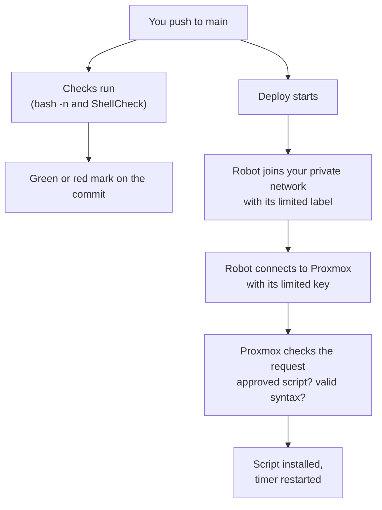

> [!NOTE] In plain words
> When you push a script to `main`, it lands on `proxmox-a8` by itself. It goes through a locked-down path that can do one thing only: install two approved scripts. How to run it: [[Automation Administration]]. The scripts it installs: [[Proxmox Administration]].

> [!TIP] Words used on this page
> - **CI**: automatic checks that run on every change.
> - **Deploy**: putting the checked script where it runs, here on Proxmox.
> - **Workflow**: a file that tells GitHub what to do and when.
> - **Runner**: the temporary computer GitHub lends you to run a workflow. It is deleted afterwards.
> - **Tailscale network (tailnet)**: your private network of PC, phone, and Proxmox.
> - **Tag**: a label on a machine. The runner gets the label `tag:ci-deploy`.

# Current State (as of 2026-09-22)

## Why it exists

The watchdog scripts used to live only on the Proxmox host, and you edited them by hand there. When a fix got lost, nothing else had a copy, and nothing checked the scripts for mistakes. Now this repo holds the real copy. You change it here, it gets checked, and it gets deployed without copying anything by hand.

## How it works

> [!IMPORTANT]
> The checks and the deploy start **at the same time**. The deploy does **not** wait for the checks. A ShellCheck warning shows a red mark but does not stop the deploy. What blocks a broken script is the `bash -n` syntax check inside `deploy.sh` and on the host itself.

## What is where

| Piece | Where | What it does |
|---|---|---|
| Checks (CI) | `.github/workflows/ci.yml` | Looks for mistakes in scripts on every push |
| Deploy | `.github/workflows/deploy.yml` | Joins Tailscale and installs both scripts |
| Deploy script | `HomeLab/5 - Automation/scripts/deploy.sh` | The one way to deploy, used by you and by the robot |
| Gatekeeper | `scripts/ci-deploy-watchdog.sh`, installed on the host | The only thing the robot's key is allowed to run |
| Watchdogs | `scripts/fix-orphan-taps.sh` and `fix-down-interfaces.sh` | The scripts being deployed |

The two workflow files must stay in `.github/workflows/` at the top of the repo. GitHub only looks there.

## Security: Five Layers

The idea is that one thing going wrong is never enough to cause damage. Each layer limits what the next one can do.

1. **GitHub secrets.** The robot's passwords are stored encrypted and hidden in logs. Workflows from other people's copies of the repo need your approval to run.
   *Protects against:* strangers finding or using your passwords.
2. **Tailscale rules.** The robot's label lets it reach Proxmox on port 22 and nothing else. Your other devices are unreachable to it. Tailscale also tests these rules every time you save them.
   *Protects against:* a hijacked robot getting into your PC or the rest of your network.
3. **Short-lived join keys.** The robot gets a fresh key each run that expires quickly, instead of one password that lasts forever.
   *Protects against:* a stolen network password.
4. **A limited SSH key.** On the host, the robot's key is set so it cannot open a shell, forward ports, or run any command except the gatekeeper.
   *Protects against:* a leaked key turning into a login on your host.
5. **The gatekeeper.** It only accepts "install script X" for two approved scripts, and refuses any script with a syntax error.
   *Protects against:* installing anything other than a valid, approved script.

> [!TIP] We tested this
> On 2026-09-18, we tried `whoami` and `cat /etc/shadow` with the robot's key. Both were refused, and so was a script name that was not on the approved list.

## Why it is built this way

| Choice | Reason |
|---|---|
| The repo stays public | The history was scanned first and holds no keys or passwords. Only the Tailscale address is visible, and it only works inside your network. The pipeline is also your best portfolio piece. |
| Its own folder, `5 - Automation` | It will grow beyond Proxmox (AD, PowerShell). |
| Install both scripts every time | Reinstalling an unchanged script does no harm, and it avoids extra logic to work out which changed. |
| A dedicated key and Tailscale client | You can remove either one without affecting anything else. |
| Pinned to `@v4` | You get fixes, but not surprise changes. |
| Scripts forced to Linux line endings | Windows would add hidden characters that break the first line, `#!/bin/bash`, on Linux. |

## Known limits

> [!WARNING]
> These are gaps that exist today, not bugs. Know them before you rely on the pipeline.

- **Deploy does not wait for the checks** (see the note above). They are two separate workflows, so a `needs:` line cannot link them. To fix it, run the checks inside `deploy.yml`, or start Deploy with `workflow_run` after the checks pass.
- **The approved list is in two places:** on the host and in `deploy.yml`. A new script means updating both.
- **The gatekeeper cannot update itself.** You copy it to the host by hand whenever it changes.
- **Only the scripts are deployed.** The `.service` and `.timer` files were made by hand.
- **The key logs in as root** on the host. The limits make that acceptable, but a low-privilege user would be tighter.
- **No automatic undo.** To roll back, revert the commit and push.
- **Actions are pinned by version, not by exact commit.**
- **No alerts.** A failure only shows in the Actions tab on GitHub.

# Change Log

### 2026-09-22: First real deploy

Pipeline built 2026-09-18 and moved to `5 - Automation` on 2026-09-19. Setup finished 2026-09-22: Tailscale label and rules, OAuth client, three GitHub secrets, and `tailscale/github-action` moved from `@v3` to `@v4` after checking its README (input names unchanged). Pushed to `main`: checks and deploy both green. On the host, both scripts matched the repo and both timers were running. Evidence in [[Automation Administration]].

Same day, this doc was corrected: it had said the checks block the deploy, which they do not.
