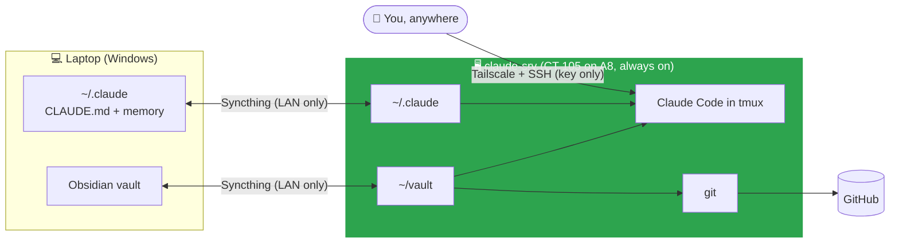

# Claude Server Design

Related: [[claude-srv]] · [Homelab - Inventory](<../1 - Infrastructure/Homelab - Inventory.md>) · [[Proxmox Administration]] · [[Tailscale]]

## Current State

> [!NOTE] Goal
> Claude Code sessions that keep running when the laptop sleeps or is closed, with the same docs, memory and instructions on both machines and no manual sync step.

Git runs only on the server (one writer). Secrets never sync: each host has its own.

| Decision | Choice | Why |
|---|---|---|
| Host | LXC container on the A8 | A8 is the always-on node. `proxmox-lab` is dual-boot and not always on. |
| Guest type | Unprivileged LXC, not a VM | A8 has only 2 cores. Claude Code is a single CLI process and does not need a full kernel. |
| Network | `vmbr1` (LAN side of pfSense) | Keeps it behind the firewall. `vmbr0` is the ISP side. Moves to the Servers or Management VLAN once VLANs are live. |
| Remote access | Tailscale + OpenSSH (key only), Claude inside `tmux` | Reachable from anywhere without port forwards. `tmux` keeps the session alive across disconnects. |
| File sync | Syncthing, laptop to server, LAN only | Continuous and automatic. Git-as-sync depends on remembering commit/push/pull on two machines. |
| Version control | Git runs only on `claude-srv` | One writer means no git state conflicts. Syncthing ignores `.git` on both sides. |
| Secrets | Never synced | Claude login, SSH keys and Tailscale identity are created per host, so one can be revoked without touching the other. |

### What syncs

| Syncthing folder | Laptop | Server | Notes |
|---|---|---|---|
| `vault` | `~/Documents/Obsidian Vault` | `~/vault` | Ignores `.git`, `.claude`, `.trash`, Obsidian workspace files |
| `claude-config` | `~/.claude` | `~/.claude` | Include-only: `CLAUDE.md` and `global-memory/`. Everything else in `~/.claude` (credentials, sessions, settings) stays per host. |
| `homelab-memory` | `~/.claude/projects/C--Users-Clyde-Documents-Obsidian-Vault/memory` | `~/.claude/projects/-home-clyde-vault/memory` | Claude names the memory folder after the project path, so the name differs per host. Syncthing maps them to the same content. |

- Ignore files (`.stignore`) are per device and not synced. They are set identically on both sides.
- `claude-srv` keeps deleted or overwritten files in `.stversions/` for 30 days (trash can versioning).
- Global discovery, relays, NAT traversal and usage reporting are off on both devices. Sync only happens over the LAN (and Tailscale once added as a device address).
- The global `CLAUDE.md` uses `~`-relative paths so it is valid on both hosts.

### Known limitation

> [!WARNING] Nested folder not watched on Windows
> `homelab-memory` sits inside the `claude-config` folder root. On Windows the file watcher does not report changes in that nested folder, so the two Claude folders rescan every 60 seconds instead of relying on the watcher. The vault is not nested and syncs within about 10 seconds.

## Change Log

### 2026-09-23: Designed and built

Designed after laptop sleep was found to kill local Claude Code sessions (same failure mode that killed a `vzdump` during the [[Proxmox Lab Setup]] migration). Built the same day, see [[claude-srv]].
