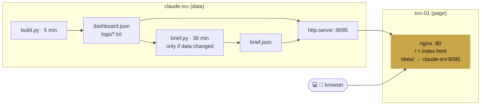

# Hermes Dashboard Design

Related: [[Hermes Dashboard]] · [[Hermes Design]] · [[Homepage Design]] · [[svc-01]] · [[claude-srv]]

The lab's main dashboard, and a small second brain: what to do today, where the roadmap stands, what the lab and the automations are doing, and the job search, in one full-screen page with the Hermes look (black, champagne, gold).

## Decisions

| Decision | Choice | Why |
|---|---|---|
| Standalone page, not inside Homepage | Own full-screen page at `http://10.10.10.30` | The iframe inside Homepage was squeezed into a card, got cut off on the phone, and Homepage's generic tiles sat underneath. A page of its own uses the full width and needs no resizing tricks. Homepage stays at `:3000` as a plain backup. |
| Where the data is built | claude-srv | Git history, Hermes reports, systemd and Claude all live there. svc-01 gets no SSH keys or journal access to another host. |
| Where the page is served | nginx on svc-01, port 80 | svc-01 is the container host and has a stable address. nginx proxies `/data/` to claude-srv, so the browser talks to one origin (no CORS) and claude-srv's port stays an internal detail. |
| Caching | `Cache-Control: no-cache` on the page, `no-store` on data | The phone kept an old Homepage `custom.css`. A dashboard must never show a stale version. |
| Host checks | TCP connect from claude-srv, sequential | No raw sockets in an unprivileged CT, so no ping. Sequential because parallel threads added ~35 ms of noise to every reading. |
| Hand-edited data | `~/dashboard/config.json` (services, quick links, cert states) | Things only Clyde knows. One small file instead of editing code. |
| Task ticks | Browser `localStorage`, keyed by the report date | Read-only design: the page never writes back to the server. Ticks are per browser and reset with each new morning report. |
| Layout | 3 columns (Today · Briefing · Lab), 2 below 1280 px, 1 below 860 px | Inspired by Glance and Notion "second brain" homelab setups: one purpose per card, most important first on the phone. |
| Roadmap | Stepper of gold diamonds on a line, current phase highlighted, click for the note | One line instead of 8 rows. ◆ is the Hermes mark. |

## Structure (2026-09-25 redesign)

Hermes is the Greek god of crossings: roads and travellers, boundary markers (herms), trade and luck, the messenger. Clyde is mid-crossing (support to security, job to job, phase to phase), so the dashboard is a guide, not a monitor: it answers "what do I do now" before "how is everything".

| Order | Section | Question it answers | Principle |
|---|---|---|---|
| 1 | Hero: Hermes speaks | Where do I stand? | Most important first (Few: at-a-glance, top-left) |
| 2 | The one thing | What single action matters most? | Fewer choices, faster start (Hick's law, decision fatigue) |
| 3 | KPI strip: Road, Streak, Lab, Fortune, Claude | Is anything off? | Summary tier of progressive disclosure, 3 to 5 KPIs |
| 4 | Errands (one list, today / soon, tick off) | What else? | Open loops pull attention until closed (Zeigarnik); progress bar fills toward done (goal gradient) |
| 5 | Fortune (job search) | Where is money coming from? | Live processes and follow-ups due, not the full list: action over inventory |
| 6 | The road (phases + cert path) | How far along the journey? | Visible progress on meaningful work (Amabile, progress principle) |
| 7 | Sentinels, Wins, Upcoming | Detail on demand | Context tier; tabs and taps for detail |
| 8 | Wisdom | What do I learn today? | Two-column reading layout, reflection question last |

- Briefing and reminders merged into one prioritised **Errands** list written by Hermes (career first when time sensitive, then security), removing the duplicates between "pending" and "today".
- Streak nudge uses loss aversion lightly ("commit today to keep it"), never red.
- Night nudge: between 01:00 and 06:00 the greeting may suggest sleep, once.

## Security rules

- Mail and calendar data come through a Claude call limited to two read-only tools. Email content is treated as untrusted input.
- LAN and Tailscale only. Never port-forward `:80`, `:3000` or claude-srv `:8095`: no authentication, and the page shows job applications and script logs.
- Read-only: nothing on the page starts, stops or changes anything.
- No secrets in `config.json`, and scripts must not log secrets (their last 40 lines are public on the LAN).
