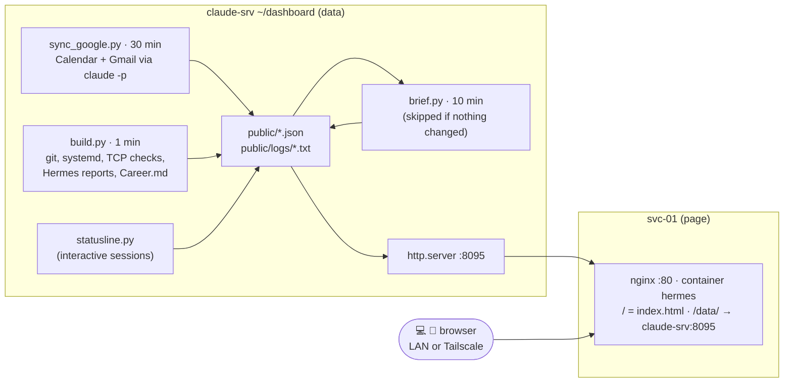

# Hermes Dashboard

Related: [[Hermes Dashboard Design]] · [[Hermes]] · [[Homepage]] · [[svc-01]] · [[claude-srv]]

## Current State



| Item | Value |
|---|---|
| URL | LAN `http://10.10.10.30` · Tailscale `http://100.102.216.72` or `http://svc-01` |
| Page | svc-01 `~/hermes/`: `docker-compose.yml` (`nginx:alpine`, container `hermes`, `80:80`), `nginx.conf`, `site/index.html` |
| Page source | claude-srv `~/dashboard/site/index.html`, `~/dashboard/svc-01/` (copied to svc-01) |
| Data | claude-srv `~/dashboard/`: `build.py`, `brief.py`, `sync_google.py`, `statusline.py`, `config.json`, output in `public/` |
| Refresh | Page polls every 15 s, header shows **Live** / **Offline** (no data for 45 s) |
| Not in git | `~/dashboard` (and `~/hermes-mail`) live only on claude-srv |

### systemd units (claude-srv, system units unless noted)

| Unit | Schedule | Does |
|---|---|---|
| `dashboard-build.timer` / `.service` | every minute | `build.py` → `dashboard.json`, `logs/*.txt`. `User=clyde`, `SupplementaryGroups=systemd-journal` |
| `dashboard-brief.timer` / `.service` | every 10 min | `brief.py`: Claude writes `brief.json` (skipped when the data hash is unchanged, at least once a day) and `lesson.json` (once per new lesson) |
| `dashboard-google.timer` / `.service` | every 30 min, 07:00 to 01:30 | `sync_google.py`: `claude -p` limited to Calendar `list_events` and Gmail `search_threads` → `calendar.json`, `mail.json` |
| `dashboard-http.service` | always | `python3 -m http.server 8095`, read-only (`ProtectSystem=strict`, `ProtectHome=read-only`) |
| status line (`~/.claude/settings.json`) | on redraw | `statusline.py` → `usage.json` |

### Page layout (top to bottom)

| Section | Shows | Source |
|---|---|---|
| Top bar | Quick links, Live dot, clock | `config.json` `links` |
| Hero | Greeting, situation message, alert | `brief.json` (`greeting`, `message`, `alert`) |
| The one thing | Single most valuable action, why, minutes, Mark done | `brief.json` `one_thing` |
| KPIs | The road, Streak, Lab, Fortune, Claude usage | `build.py`, `usage.json` |
| Briefing (5/12) | Situation by topic: Today, Inbox, Career, Lab, Security, Money, Last done | `brief.json` `briefing` |
| Errands (7/12) | One prioritised list, Today / Soon, area tag, minutes, tick off, progress bar | `brief.json` `errands` + `reminders.json` |
| Upcoming (5/12) | Next 7 days of events, reminders count | `calendar.json`, `reminders.json` |
| Messages (7/12) | Up to 8 inbox threads that matter, category, "reply" tag, unread count, link to Gmail | `mail.json` |
| Fortune (5/12) | Pipeline bar, live processes, follow-ups due (7 to 21 days), reply rate | `Career.md` `## Job search log` via `build.py` |
| The road (7/12) | Phase stepper, all 8 phases with bar and note, cert path | Latest Hermes morning report `phases`, `config.json` `certs` |
| Sentinels (6/12) | Tabs: Hosts (TCP check + latency), Scripts (tap for log summary), Watchdogs | `config.json` services, systemd `UNITS`, Proxmox API journal |
| Wins (6/12) | Highlights (48 h), day-by-day commits (5 days), 26-week heatmap | `brief.json` `wins`, `build.py` `daily`, `heatmap` |
| Wisdom (12/12) | Quote, excerpt, key ideas, For you today; the idea, story, why, 3 actions, watch out; reflection question | `lessons.json` via `build.py`, `lesson.json` |

Ticks (errands, the one thing) are kept in the browser (`localStorage`), per task text. Phone: one column in the same order.

### Data formats for other tools

```jsonc
// public/calendar.json  (written by sync_google.py)
{"source": "Google Calendar", "at": "25/09 07:00", "events": [{"title": "Interview Acme", "start": "2026-09-26T10:00:00+02:00", "end": "...", "location": "Teams", "all_day": false}]}
// public/mail.json  (written by sync_google.py)
{"at": "25/09 07:00", "unread": 201, "items": [{"from": "...", "subject": "...", "summary": "...", "category": "job|admin|money|personal|lab|other", "needs_reply": true, "date": "...", "url": "https://mail.google.com/..."}]}
// public/reminders.json  (no source yet)
{"items": [{"text": "Rearm DC01 eval", "due": "2026-11-15T09:00:00+01:00", "done": false}]}
```

### Watchdog feed: read-only Proxmox token (to do, Clyde)

`build.py` reads the A8 journal through `GET /api2/json/nodes/proxmox-a8/journal`. The token needs `Sys.Syslog` only: it can read logs, nothing else. The A8 certificate is self-signed, so `build.py` pins its SHA-256 fingerprint (`config.json` `watchdogs.fingerprint`) and refuses to send the token if it changes.

```bash
# on proxmox-a8
pveum role add DashboardLog -privs Sys.Syslog
pveum user add dashboard@pve --comment "Hermes dashboard, read-only journal"
pveum acl modify /nodes/proxmox-a8 -user dashboard@pve -role DashboardLog
pveum user token add dashboard@pve feed --privsep 0      # prints the secret once
# on claude-srv
echo 'dashboard@pve!feed=<secret>' > ~/.config/pve-dashboard.token && chmod 600 ~/.config/pve-dashboard.token
```

Check the pinned fingerprint against the Proxmox GUI (node, System, Certificates) before trusting it.

### Operations

| Task | Command |
|---|---|
| Change hosts, links or cert states | Edit `~/dashboard/config.json` on claude-srv (live within a minute) |
| Add an automation | One line in `UNITS` in `build.py` |
| Deploy a page change | `scp ~/dashboard/site/index.html adm-jnclyde@10.10.10.30:hermes/site/` (no restart needed) |
| Rebuild data now | `sudo systemctl start dashboard-build.service` |
| Force a new briefing | `rm ~/dashboard/brief.hash && sudo systemctl start dashboard-brief.service` |
| Sync calendar and mail now | `sudo systemctl start dashboard-google.service` |
| Page logs (svc-01) | `cd ~/hermes && docker compose logs -f hermes` |
| Data job logs (claude-srv) | `journalctl -u dashboard-build -u dashboard-brief -u dashboard-google -n 50` |

## Change Log

### 2026-09-25: Built (replaces the Hermes panel inside Homepage)

- Clyde's feedback on the panel: badly separated, generic, only used the middle of the screen, cut off on the phone, and Homepage's own tiles still looked default there (phone cached the old `custom.css`).
- Built a standalone full-screen page: top bar (quick links, clock), hero (greeting, alert, 4 stats), roadmap stepper, three columns Today / Briefing / Lab, single column on the phone.
- New features: live host checks with latency, 12-week commit heatmap, today's tasks you can tick off, lesson of the day, activity timeline, job search kanban, cert path.
- `build.py`: added `services`, `heatmap`, `today`, `lesson`, `links`, `certs`. New `config.json`. `brief.py` hash now includes host up/down.
- svc-01: new `nginx:alpine` container `hermes` on `:80`, proxies `/data/` to claude-srv `:8095`.
- Homepage: Hermes iframe group and its `layout` entry removed (backup `~/homepage/services.yaml.bak-20260925b`). Homepage keeps the gold theme.
- **Issue:** first host checks read ~37 ms for every host, localhost included: thread scheduling noise from checking in parallel. Made sequential, now 0 to 3 ms.
- **Verification:** `http://10.10.10.30/` 200 with `Cache-Control: no-cache`, `/data/dashboard.json`, `/data/brief.json` and `/data/logs/claude-rc.txt` 200 through the proxy. Host checks: pfSense, both Proxmox nodes, claude-srv, svc-01 up; DC01 and WIN11-01 down (VMs off). Visual check on desktop and phone: pending (Clyde).

### 2026-09-25: Redesign, usage bar, watchdogs, calendar and reminders

- Clyde's feedback: text too small, too much information, name and description ran together in the Lab list ("pfSenseFirewall": both were inline spans). References: Muzli "best dashboard design examples 2026" (surface the key figures, minimal noise, drill down for detail) and Dribbble phase/stepper UIs.
- Bigger type everywhere (base 15.5 px, KPIs 44 px serif). Fewer items visible: pending shows the top 3 with "Show all", automation log summaries open on tap, Hosts / Automations / Watchdogs merged into one Systems card with tabs. Roadmap stepper redrawn: larger diamonds, current phase with a halo, detail line with the phase percentage.
- New: Claude usage bars (status line hook), KPI row, Upcoming and Reminders cards (empty state until the calendar MCP writes their files), Watchdogs tab (Proxmox API, pinned certificate).
- `~/.claude/settings.json` on claude-srv: `statusLine` runs `~/dashboard/statusline.py`. Not synced to the laptop (Syncthing only takes `CLAUDE.md` and `global-memory` from `~/.claude`).
- **Verification:** status line script tested with sample input, then a live interactive session wrote real values within seconds (5-hour 14 %, weekly 17 %). Proxmox journal call reaches the API and is refused with `401 no such user`, as expected before the token exists. Page 200. Visual check: pending (Clyde).

### 2026-09-25: Layout fixes, stale usage

- Greeting used a narrow column (5 lines): hero now gives it 2.2 of 3.2 parts of the width, balanced wrapping, and `brief.py` caps it at 12 words. Pending items are 12 words max, each in its own rounded box with a numbered circle.
- **Issue:** usage bar showed 14 % while `/usage` said 80 %. Cause: the status line only runs in interactive sessions and the tmux ones were idle; Remote Control sessions (where the usage happened) never run it. The bar now fades and says "stale" when the reading is older than 20 minutes. Reading usage through the account's OAuth token was considered and rejected by Clyde.
- Left column looks empty until the calendar and reminders are connected: accepted as is.

### 2026-09-25: Detailed lesson card

- The lesson card showed only the quote and book, off-centre next to the email's full version. `build.py` now passes `idea`, `chapter`, `excerpt`, `key_points`; the card has a centred header (ornament, quote, book, idea), the excerpt, numbered key ideas and a "For you today" box.
- Usage bar is not real time: the page polls every 60 s, but the value only changes when an interactive Claude Code session on claude-srv redraws its status line.

### 2026-09-25: Real time, lesson study, number circles

- **Real time:** page polls every 15 s (was 60), data rebuilt every minute (was 5 min), briefing checked every 10 min (was 30, still skipped when nothing changed). Header shows a pulsing **Live** dot that turns red "Offline" if no data arrived for 45 s. Clock ticks every second. Exceptions: phases and today's tasks change once a day (Hermes morning report), Claude usage only when a terminal session redraws.
- **Lesson study:** `brief.py` asks Claude once per new lesson for a deeper study (idea, story from the book, why it works, 3 actions for this week, watch out, reflection question), cached in `public/lesson.json` by a hash of book + quote. Prompt forbids invented quotes and unattributed examples. First study (Law 25) used George Sand, which is the book's own example.
- **Issue:** numbers in the pending circles sat low. Cause: Cormorant Garamond uses old-style figures (3, 4, 5 descend below the baseline). Circles now use Inter lining figures.
- Timers edited in `/etc/systemd/system/dashboard-{build,brief}.timer`.

### 2026-09-25: Redesign around Hermes as a guide

- Clyde's feedback: space badly distributed (lesson card too long in one column, others cramped), briefing felt like a reminder list duplicating Today, wanted it useful and personal, backed by research, with Hermes as a persona.
- Research used: Stephen Few (dashboard = most important information at a glance), progressive disclosure (summary, context, details), Amabile and Kramer's progress principle, Zeigarnik and goal-gradient effects, Hermes mythology (god of crossings, roads, herms, trade, luck).
- New layout: hero (Hermes message + **The one thing** with Mark done), 5 KPIs, **Errands** (7/12) + **Fortune** (5/12), **The road** full width with cert path, **Sentinels / Wins / Upcoming** in thirds, **Wisdom** full width in two columns. Phone: one column in priority order. Activity timeline replaced by Wins; Today, Briefing and Reminders merged into Errands.
- `brief.py`: new persona and schema (`message`, `one_thing`, `errands` with area and when, `wins`), jobs summarised instead of the full 75-row list, date in the hash so errands are re-planned daily.
- `build.py`: jobs `total`, `reply_rate`, `this_week`, `live`, `follow_up` (no reply for 7 to 21 days, oldest first); heatmap 26 weeks.
- Ticks (errands and the one thing) are stored in the browser per task text, so they survive a rewritten briefing.
- **Verification:** first run of the new briefing: one thing = a time-sensitive career decision, 7 errands without duplicates, 4 wins. Page 200, script brackets and template literals balanced. Visual check: pending (Clyde).

### 2026-09-25: Briefing card back, equal-height rows

- Clyde wants a briefing on the general dashboard, separate from the errands. `brief.py` adds `briefing` (4 to 5 topics: Last done, Lab, Career, Security, Automations; situation only, tasks stay in errands). New layout rows: Briefing 5/12 + Errands 7/12, Fortune 5/12 + The road 7/12.
- Gaps under short cards fixed: grid rows now stretch so cards in a row share a height; Upcoming lays out in two columns when it is full width.
- First briefing flagged a stale item: the morning report still carries the "duplicate DC01" task although it was closed on 2026-09-24.

### 2026-09-25: Phase details and daily wins

- The road and Wins cards had empty space once rows share a height. The road now lists all 8 phases under the stepper (progress bar, state, Hermes's note; click a step or a row to highlight). Wins adds "Day by day": last 5 days with commits, count and the first 3 subjects. `build.py` adds `daily` (7 days).
- Homepage became the lab-only dashboard in the same style, see [[Homepage]].

### 2026-09-25: Google Calendar and Gmail

- Claude.ai connectors (Gmail, Google Calendar) only work inside a Claude session, so `sync_google.py` asks `claude -p` with `--tools ""` and `--allowedTools` limited to calendar `list_events` and Gmail `search_threads`: nothing can send, delete or edit. The prompt treats email subjects and snippets as untrusted data; the page escapes all of it and only links to `https://mail.google.com/`.
- `build.py` adds `mail`; `brief.py` gets calendar and mail (without sync timestamps in the hash), Hermes now briefs on the day as well as the lab (Today, Inbox, Career, Lab, Security, Money) and turns emails needing a reply into errands.
- Layout: Upcoming 5/12 + Messages 7/12 right after Briefing and Errands; Sentinels and Wins share the row after The road.
- **Verification:** first sync 23 s: 0 events (calendar confirmed empty for 2 weeks by a direct query), 8 mail items (2 flagged for reply), 201 unread. Briefing written with 6 topics, one thing = a time-sensitive career decision.
- **Privacy:** the page now shows email senders and one-line summaries to anyone on the LAN. Another reason never to expose `:80`.

