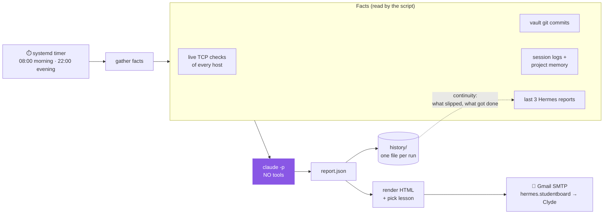

# Hermes Design

Related: [[Hermes]] · [[claude-srv]] · [Homelab - Inventory](<../1 - Infrastructure/Homelab - Inventory.md>)

> [!NOTE] In plain words
> Every morning and every night, a small script on `claude-srv` collects what happened in the lab, asks Claude to write a report from those facts only, and emails it to Clyde with a lesson from one of his books.

## How it works

## Decisions

| Decision | Choice | Why |
|---|---|---|
| Engine | Claude Code (`claude -p`) on the Pro plan | Hermes Agent (Nous Research) cannot use Claude Pro, only Max + extra credits or a paid API key. Its install was also blocked in the session. `claude -p` is the official way to run Claude non-interactively. |
| Model access | `--tools ""` (no tools at all) | The model can only read the facts the script hands it and write text back. It cannot run commands, read files or change anything. Least privilege. |
| Host | `claude-srv` | Always on, already runs Claude Code and holds the vault and memory the report is built from. |
| Delivery | Plain SMTP to Gmail with an App Password | One secret, revocable in one click, on a dedicated bot account. |
| "Learning" | Last 3 reports fed back in, plus a lesson history | Lets each report notice what got done and what keeps slipping, and never repeat a lesson until all 16 have been sent. |
| Lessons | 16 lessons from 8 books, tagged by mood | Claude picks mood tags from evidence (late sessions, open risks, progress). The script picks the unsent lesson that best matches. |
| Failure | Short "run failed" email with the error | A silent failure would look like "nothing happened". |

## Emails

| | Morning (08:00) | Evening (22:00) |
|---|---|---|
| Header + 4 stats | ✅ | ✅ (about today) |
| Urgent box | if any | only if genuinely urgent |
| 3 tasks by impact | today's | tomorrow's first 3 |
| Status by phase A to H | ✅ | |
| What I learned | ✅ | ✅ |
| Decision / reflection | decision | reflection for tomorrow |
| Lesson of the day | full: quote, excerpt, key ideas, "for you today" | compact: quote + "for you today" |
| Hosts + pending checklist | ✅ | |

## Security rules

> [!CAUTION]
> - The App Password lives only in `~/hermes-mail/.env` (`chmod 600`). Never in the vault, memory or git.
> - The model gets **no tools**. Do not add `--tools` or `--permission-mode` flags to the run.
> - The report can contain internal IPs and open weaknesses: it only goes to Clyde's own inbox.

## Known limits

- Host checks are plain TCP connects from `claude-srv`. A closed port (e.g. RDP off on WIN11-01) shows as "no answer" even if the machine is up.
- Every run uses a little of the Claude Pro allowance (about 1 minute each).
- The code lives only on `claude-srv` (`~/hermes-mail/`), not in the repo.
