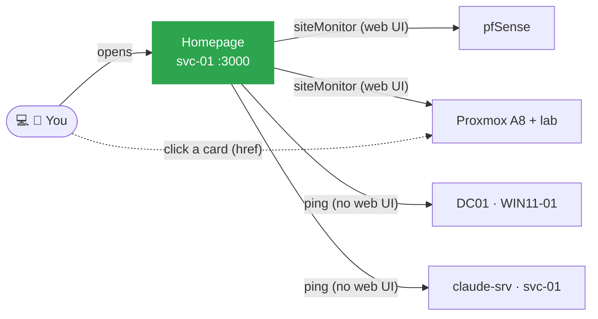
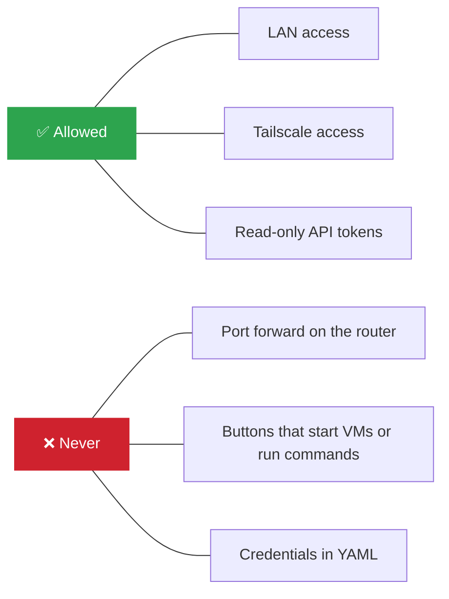
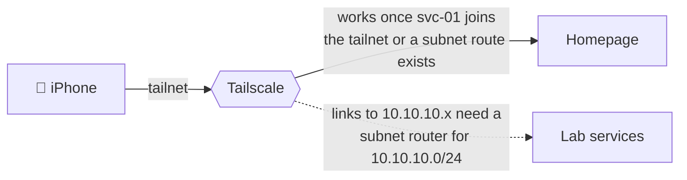

# Homepage Design

Related: [[Homepage]] · [[svc-01]] · [Homelab - Inventory](<../1 - Infrastructure/Homelab - Inventory.md>)

Services dashboard for the lab: one page listing every service with its link and an up/down status, usable from the laptop and the phone.

Solid lines: status checks, run **from the container**. Dotted line: links, opened **by your browser**.

## Role (since 2026-09-25)

Homepage is **Hermes · Lab**: the lab-only dashboard (roadmap, hosts, automations, watchdogs, lab bookmarks), styled like the main Hermes Dashboard. Daily life, mail, calendar and job search live on [[Hermes Dashboard]].

## Decisions

| Decision | Choice | Why |
|---|---|---|
| Tool | **Homepage** (gethomepage.dev) | Solves the actual problem (knowing what runs where) with almost no resources. Config is plain YAML, which is practice for later IaC work. |
| Rejected for now | Zabbix, Grafana | Different problem. Zabbix is monitoring and alerting (server + database + frontend, too heavy for the A8). Grafana only draws data another system collects. Both belong to Phase D.5 Monitoring, on a host still to be decided (the Ryzen node is not available), where Zabbix plus Grafana becomes a portfolio piece. |
| Host | `svc-01` (CT 106 on the A8) | Always on. Separate from `claude-srv` so a broken Docker update cannot take down Claude sessions, and the reverse. Stays here: the Ryzen node is not available. |
| Runtime | Docker Compose | The whole service is one file, rebuildable in seconds. Config lives on the host through a bind mount, so the container is disposable. |
| Status checks | `siteMonitor` for anything with a web UI, `ping` for hosts without one | `href` is opened by the viewer's browser. `siteMonitor`/`ping` run from the container. A card can be green and still have a link that does not work from the phone. |
| Progress data | JSON file built on **claude-srv**, served on `:8095`, read with `customapi` | The data (git history, Hermes reports, systemd) lives on claude-srv. Building it there and exposing one read-only file keeps svc-01 free of SSH keys or journal access to another host. Homepage stays a viewer. |
| Hermes panel (superseded 2026-09-25) | Was an HTML page embedded with the `iframe` widget; now a standalone dashboard, see [[Hermes Dashboard Design]]. Homepage became Hermes · Lab, the lab-only view | `customapi` cards only show fixed boxes or label/value rows, so no one-line roadmap, side column or long text. Frontend generated; the data stays in `build.py`. |
| Briefing | `claude -p` every 30 min, **only when the data hash changed** | Same method as the Hermes emails. Quiet hours cost no Claude usage. Facts only: the prompt forbids inventing work or applications. |
| Script status source | systemd journal `JOB_RESULT`, not `ExecMainExitTimestamp` | The journal survives reboots, systemd's in-memory state does not. |
| VM access | Links to the Proxmox noVNC console on `proxmox-lab` | One click to the console, "Start Now" if the VM is off. Pinned to the lab node so the dashboard never starts the A8 rollback copy of DC01 (USN rollback risk). |

## Security rules

> [!CAUTION]
> Homepage has **no authentication**. Anyone who can reach `10.10.10.30:3000` sees the whole map of the lab.

- **Never port-forward it.** Remote access only through Tailscale.
- **No control actions** (start VM, run command) from the dashboard. Control stays inside tools that authenticate (Proxmox, SSH, claude.ai). API tokens, when added for widgets, are **read-only**.
- No credentials in YAML files.
- The progress feed (`claude-srv:8095`) has no authentication either. Same rules: LAN and Tailscale only, read-only files, nothing that runs commands. The logs it serves are the last 40 lines per unit; don't log secrets from scripts. The panel also shows job applications (company, role, status): fine on the LAN, but another reason never to expose `:8095` or Homepage publicly.

## Remote access (phone)

Tailscale. The dashboard itself is reachable on `svc-01` once it joins the tailnet or a subnet route exists. Links to `10.10.10.x` only work from the phone once a Tailscale **subnet router** advertises `10.10.10.0/24`. Pending, see [[Homepage]].
