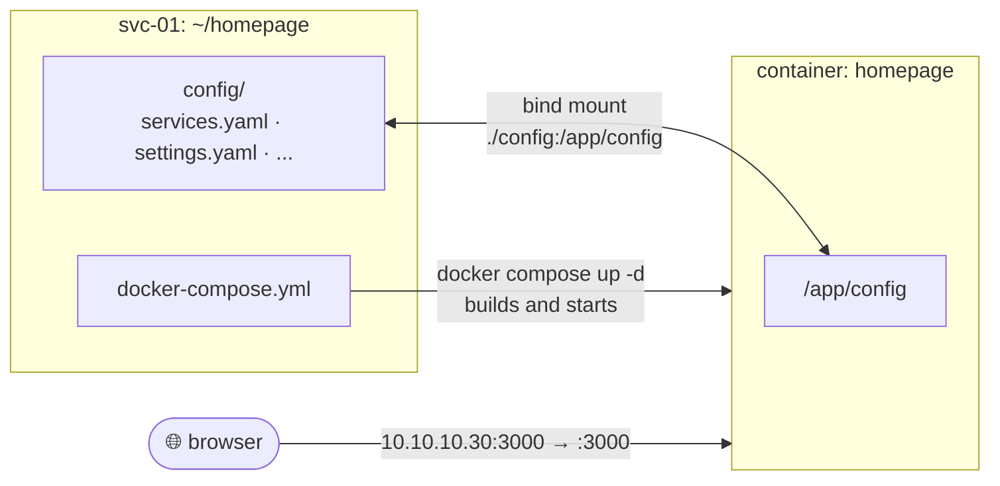

# Homepage

Related: [[Homepage Design]] · [[svc-01]] · [[pfSense Configuration]]

## Current State



<sub>Edit `config/*.yaml` and refresh the browser. Edit `docker-compose.yml` and run `docker compose up -d`.</sub>

| Item | Value |
|---|---|
| URL | `http://10.10.10.30:3000` |
| Host | `svc-01` (CT 106), user `adm-jnclyde` |
| Location | `~/homepage/` (`docker-compose.yml` + `config/`) |
| Image | `ghcr.io/gethomepage/homepage:latest` |
| Config | `~/homepage/config/*.yaml`, re-read on page load (no restart needed). Only `services.yaml` customised. Hermes group source: `claude-srv:~/dashboard/homepage/` (`services-hermes.yaml`, `settings-layout.yaml` for `layout:`, `custom.js` resizes the panel iframe, `custom.css` = Hermes theme for the whole page + panel fallback height). `settings.yaml`: `title: Hermes`, `theme: dark`, `color: stone`. |

### `docker-compose.yml`

```yaml
services:
  homepage:
    image: ghcr.io/gethomepage/homepage:latest
    container_name: homepage
    ports:
      - "3000:3000"            # HOST:CONTAINER
    volumes:
      - ./config:/app/config   # HOST:CONTAINER
    environment:
      HOMEPAGE_ALLOWED_HOSTS: 10.10.10.30:3000,100.102.216.72:3000,svc-01:3000
    restart: unless-stopped
```

### Hermes · Lab (what the dashboard shows)

Homepage is the **lab-only** dashboard, styled like the Hermes main dashboard ([[Hermes Dashboard]], `http://10.10.10.30`). Config source: claude-srv `~/dashboard/homepage/lab/` (`services.yaml`, `settings.yaml`, `widgets.yaml`, `bookmarks.yaml`, `custom.css`, `custom.js`), copied to `~/homepage/config/`.

| Group | Cards | Status from |
|---|---|---|
| The road | Roadmap (phase now, progress, all phases), Lab health (hosts, scripts, watchdogs, down) | Hermes feed (`customapi`, claude-srv `:8095/dashboard.json`, `homepage` section) |
| Network | pfSense, Tailscale | `siteMonitor` / link |
| Hypervisors | Proxmox A8, Proxmox lab | `siteMonitor` |
| Identity | DC01, WIN11-01 (noVNC console links) | `ping` |
| Services | claude-srv, svc-01, Hermes | `ping` / `siteMonitor` |
| Automations | Hermes morning, Hermes evening, Remote Control, Syncthing | Hermes feed |
| Watchdogs | fix-orphan-taps, fix-down-interfaces | Hermes feed (needs the read-only Proxmox token) |
| Bookmarks | Consoles, Docs (GitHub), Hermes | links |

Top widgets: greeting "Hermes · the lab", date and time, svc-01 resources, search. `settings.yaml`: `statusStyle: dot`, `useEqualHeights: true`, `fullWidth: true`, `headerStyle: clean`, layout rows for The road (2), Automations (4), Watchdogs (2).

Console link format: `https://<node-ip>:8006/?console=kvm&novnc=1&vmid=<id>&vmname=<name>&node=<node>`

### Hermes

The Hermes panel moved out of Homepage on 2026-09-25 and is now its own dashboard at `http://10.10.10.30`, see [[Hermes Dashboard]]. Homepage stays as a plain service list with the Hermes gold theme (`custom.css`). `custom.js` still holds the old iframe resizer: harmless, remove when convenient.

### Operations (from `~/homepage`)

| Task | Command |
|---|---|
| Apply a change to `docker-compose.yml` | `docker compose up -d` |
| Apply a change to `config/*.yaml` | Save and refresh the browser |
| Logs (first stop when something breaks) | `docker compose logs -f homepage` |
| Update | `docker compose pull && docker compose up -d` |
| Stop and remove (config kept) | `docker compose down` |

## Change Log

### 2026-09-24: Built

- Wrote `docker-compose.yml` and brought it up on `svc-01`. First start generated the default config files.
- Wrote `services.yaml`: 4 groups, 7 services.
- **Issues found and fixed on the way:**
  - Proxmox links without `:8006` went to 443 and failed.
  - `ping` given as a URL (`http://10.10.10.21/`). `ping` takes a host only.
  - pfSense `siteMonitor` stayed red: the WebGUI was HTTP only and 443 was dropped. Fixed at the source by switching pfSense to HTTPS, see [[pfSense Configuration]] 2026-09-24.
- **Verification:** dashboard loads at `http://10.10.10.30:3000`, all configured services listed (checked through `/api/services`).
- **Pending:**
  - Phone access: Tailscale on `svc-01` or a subnet router for `10.10.10.0/24`.
  - `HOMEPAGE_ALLOWED_HOSTS` must get the Tailscale address once added.
  - claude-srv card: `href` to `https://claude.ai/code` once `claude-rc` runs (see [[claude-srv]]).
  - Optional: read-only Proxmox API token for live widgets, `settings.yaml` title/theme.

### 2026-09-25: Progress group (roadmap, streak, script status)

- Added a `Progress` group with three `customapi` cards (Roadmap, Streak, Scripts) fed by a JSON file built on claude-srv. Built by Claude at Clyde's request.
- **Issues found and fixed on the way:**
  - Hermes units showed "never ran": the CT rebooted at 22:38 and systemd forgets `ExecMainExitTimestamp` on reboot. Switched to the last `JOB_RESULT` in the journal.
  - `clyde` could not read systemd's journal entries (not in `systemd-journal`). Gave the builder `SupplementaryGroups=` instead of adding `clyde` to the group, which would have meant restarting its user manager and `claude-rc`.
  - Timer `NextElapseUSecRealtime` ignores `--timestamp=unix`: parsed with `date -d`.
  - The builder listed itself and always showed "running now". Removed. Its freshness is the `Feed updated` row.
- **Verification:** `curl http://10.10.10.124:8095/dashboard.json` returns phases, streak 3 and 4 units with correct last/next runs; `/logs/hermes-evening.txt` returns 200.
- claude-srv key added to `adm-jnclyde` on svc-01 (`~/.ssh` did not exist, so the first `echo >>` failed). Progress group appended to `services.yaml`, backup at `~/homepage/services.yaml.bak-20260925` (`config/` is root-owned because Docker created it, so new files cannot go there).
- **Verification:** container reaches the feed (`docker exec homepage wget .../dashboard.json`), `/api/services` lists `Progress: Roadmap, Streak, Scripts`, `/api/services/proxy?group=Progress&service=<card>&index=0` returns the JSON for all three, no errors in the container logs. Visual check in the browser: pending (Clyde).
- **Depends on:** claude-srv keeping `10.10.10.124`. It is DHCP until the pfSense static mapping exists.

### 2026-09-25: Hermes panel replaces the Progress group

- Clyde asked for Hermes as a J.A.R.V.I.S.-style assistant on the dashboard: roadmap on one line, scripts and log summaries on the side, job applications by state, and a summary of the last work and what's pending.
- `customapi` cards could not do this layout (fixed boxes or label/value rows, long text truncated), so the panel is an HTML page on claude-srv embedded with Homepage's `iframe` widget. Progress group removed from `services.yaml`.
- Added `brief.py` + `dashboard-brief.timer` (Claude call, same method as Hermes emails), job parsing and recent commits in `build.py`.
- Homepage: `layout:` in `settings.yaml` (Hermes first, full width, no header), panel height in `custom.css` (the `iframe` widget only accepts fixed Tailwind height classes). Backups: `~/homepage/settings.yaml.bak-20260925`, `custom.css.bak-20260925`.
- **Verification:** first briefing written in 18 s. Panel returns 200 on `:8095`. `/api/services` shows `Hermes` first and no `Progress`. Job parser tested with sample rows: all four buckets (interview, pending, no reply after 7 days, rejected) correct. Visual check in the browser: pending (Clyde), no browser on claude-srv.

### 2026-09-25: Hermes panel, luxury theme and phone layout

- Panel redesigned to match the Hermes email structure (hero with date and greeting, 4 stat tiles, alert, gold-edged section cards, signature footer) in a black, champagne and gold palette shared with the email. Serif headings (Cormorant Garamond, Georgia fallback).
- Phone: single column under 860 px, stat tiles and job counters 2 x 2, roadmap letters stacked. The iframe height is no longer fixed: the panel posts its own height to the parent page and `custom.js` resizes the iframe (origin checked, clamped 300 to 4000 px).
- **Issue:** first version measured `document.documentElement.scrollHeight`, which never goes below the iframe's current height, so the panel could grow but never shrink. Measures the panel's own box instead.
- Homepage theme set to dark `stone` (warm neutral) to sit around the panel.
- **Verification:** panel 200, `custom.js` served by Homepage. Visual check on desktop and phone: pending (Clyde).

### 2026-09-25: Hermes theme on the whole page

- `custom.css` now themes all of Homepage, not only the panel: overrides Homepage's palette variables (`--color-50` to `--color-900`) with the Hermes black/champagne/gold ramp, gold small-caps group titles with a fading rule, dark service cards with a gold left edge, themed search and resource widgets, Inter font. The Hermes panel's own card is made transparent (`:has(iframe...)`) so it isn't framed twice.
- Class names taken from the running Homepage bundle (`service-card`, `service-name`, `service-description`, `service-group-name`, `information-widget-search`...), so they match this version. A Homepage update may rename them: check here first if the theme breaks after `docker compose pull`.
- Palette selector is `html[class*="theme-"]`, which outranks Homepage's `.theme-<color>`, so it applies whatever `color:` is set.
- **Verification:** `custom.css` served by `/api/config/custom.css`, no container errors. Visual check: pending (Clyde).

### 2026-09-25: Hermes panel moved out

- Removed the Hermes iframe group and its `layout` entry. The dashboard is now standalone, see [[Hermes Dashboard]]. Backup: `~/homepage/services.yaml.bak-20260925b`.

### 2026-09-25: Hermes · Lab

- Clyde: Homepage becomes the dedicated homelab dashboard, same look as Hermes. Rewrote all config files (above). `build.py` gained a flat `homepage` section in `dashboard.json` because `customapi` reads single fields more reliably than lists.
- `custom.css` rewritten to the Hermes card style: 18 px radius cards on `#131110`, gold small-caps group titles, serif values in widget blocks, glowing status dots, pill bookmarks, greeting in the Hermes serif. `custom.js` emptied (old iframe resizer).
- Backup of the previous config: `~/homepage/backup-20260925-lab/`.
- **Verification:** `/api/services` lists 7 groups, `customapi` proxy returns the feed for Roadmap, Lab health and Hermes morning, `/api/bookmarks` lists Consoles, Docs, Hermes, no container errors. Visual check: pending (Clyde).

### 2026-09-25: Reachable over Tailscale

- svc-01 joined the tailnet. `HOMEPAGE_ALLOWED_HOSTS` extended with `100.102.216.72:3000` and `svc-01:3000` (backup `docker-compose.yml.bak-20260925`), `docker compose up -d`. Closes the "phone access" pending item from 2026-09-24. Verified 200 over the tailnet.
