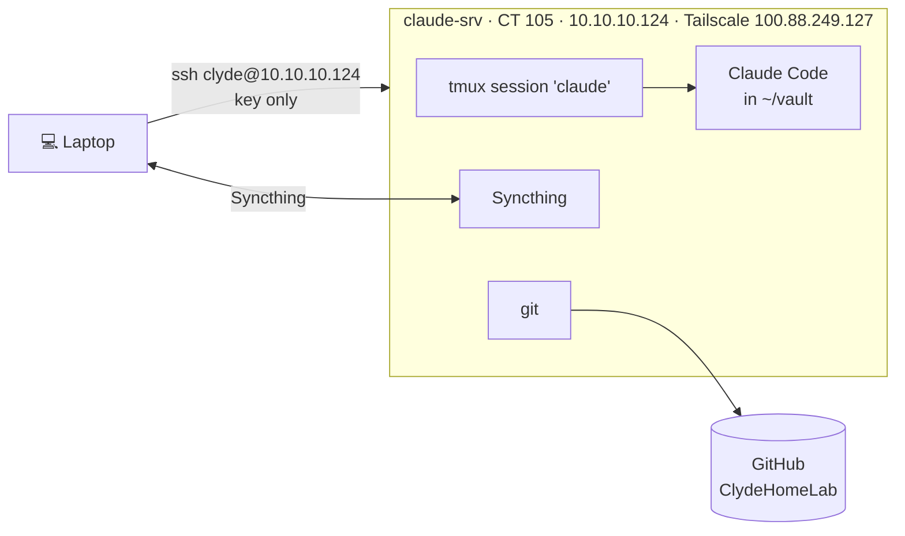

# claude-srv

Related: [[Claude Server Design]] · [Homelab - Inventory](<../1 - Infrastructure/Homelab - Inventory.md>) · [[Proxmox Administration]]

## Current State



| Item | Value |
|---|---|
| Proxmox host / ID | `proxmox-a8`, CT 105 |
| Type | Unprivileged LXC, `nesting=1`, `/dev/net/tun` passed through (`dev0`) for Tailscale |
| OS | Debian 13 (`debian-13-standard_13.6-1`) |
| Resources | 2 cores, 2048 MB RAM, 512 MB swap, 16 GB rootfs on `local` |
| Network | `net0` on `vmbr1`, DHCP, currently `10.10.10.124` (no static mapping yet) |
| Start on boot | Yes |
| Timezone | Europe/Madrid |
| Users | `clyde` (sudo, NOPASSWD). Root SSH login disabled, password auth disabled. |
| Laptop access | `ssh clyde@10.10.10.124` with the laptop's `id_ed25519` key |
| Software | Claude Code (native installer, `~/.local/bin/claude`), Syncthing v2 (`apt.syncthing.net`, `stable-v2`), Tailscale, git, tmux |
| Syncthing | `syncthing@clyde` systemd service, GUI on `127.0.0.1:8384` only |
| Hermes emails | `hermes-morning.timer` 08:00, `hermes-evening.timer` 22:00 (`~/hermes-mail`). See [[Hermes]] |
| Hermes Dashboard data | `~/dashboard`: `dashboard-build` (1 min), `dashboard-brief` (10 min), `dashboard-google` (30 min, 07:00 to 01:30), `dashboard-http` on `:8095`. Feeds both dashboards on svc-01. See [[Hermes Dashboard]] |
| Status line | `~/.claude/settings.json` `statusLine` → `~/dashboard/statusline.py` (shows 5-hour and weekly usage, saves it for the dashboard) |
| Remote Control | `claude-rc.service` user unit (see below) |
| Git | `~/vault`, remote `git@github.com:ClydeWasEjected/ClydeHomeLab.git`, key `~/.ssh/id_ed25519` (`claude-srv@homelab`), `core.autocrlf=input` |

Laptop side: Syncthing v2 unpacked to `%LOCALAPPDATA%\Programs\Syncthing`, started at logon by the `Syncthing` scheduled task, GUI on `127.0.0.1:8384`.

### Remote Control

`claude rc` runs as systemd **user** unit `~/.config/systemd/user/claude-rc.service` (enabled, linger on for `clyde`, so it starts at boot without a login). It runs inside its own tmux socket so the QR code / spawn-mode UI stays reachable.

| Setting | Value |
|---|---|
| Unit type | user unit, `Type=forking` |
| `ExecStart` | `tmux -L rc new-session -d -s rc -c ~/vault ~/.local/bin/claude rc` |
| `ExecStop` | `tmux -L rc kill-server` |
| `WorkingDirectory` | `~/vault` (new sessions open here) |
| `Restart` / `RestartSec` | `always` / `10` |
| `After` / `Wants` | `network-online.target` |
| `WantedBy` | `default.target` |

Dedicated socket `rc`: when `claude rc` exits, the tmux server exits, systemd sees the main process die and restarts it.

```bash
systemctl --user status claude-rc
tmux -L rc attach -t rc          # space = QR code, w = spawn mode, Ctrl-b d to detach
```

> [!IMPORTANT]
> One `claude rc` per folder. A second one in `~/vault` exits with "This folder is already served". Don't start `claude rc` by hand in the `claude` tmux session any more.
>
> No `--permission-mode bypassPermissions`: remote sessions keep asking before acting.

### Daily use

```bash
ssh clyde@10.10.10.124
tmux new -A -s claude      # attach if it exists, create if not
cd ~/vault && claude
# detach: Ctrl-b d  (session keeps running)
```

## Change Log

### 2026-09-23: Built

- Created CT 105 from the Debian 13 template, provisioned `clyde`, hardened `sshd` (no root, no passwords).
- Replaced Debian's Syncthing 1.29 with v2.1.5 from the official repo to match the laptop.
- Seeded `~/vault` with a byte-for-byte copy of the laptop vault including `.git`, so both sides started identical (no line-ending conflicts). `git status` clean after copy.
- Seeded `~/.claude/CLAUDE.md`, `global-memory/` and the homelab memory folder the same way.
- Paired Syncthing, added the three folders.
- **Verification:** all three folders idle with 0 errors on both sides. Laptop to server, server to laptop and delete propagation tested per folder.
- **Issue:** laptop to server changes in the memory folder never arrived. Cause: nested folder not seen by the Windows file watcher. Fixed with a 60 s rescan on the two Claude folders.
- Tailscale joined (`100.88.249.127`), GitHub deploy key `claude-srv` added with write access (first push `1b2fc47` succeeded), Claude Code logged in, Tailscale address added to the laptop's Syncthing device entry.
- **Pending:** pfSense DHCP static mapping for `10.10.10.124`.

### 2026-09-24: Remote Control design, Homepage card

- Chose `claude remote-control` as a systemd service over a dashboard button that runs commands. Homepage has no authentication, so a command button would let anyone on the LAN run it. Remote Control is authenticated by the Anthropic account.
- **Status:** Remote Control runs as `claude rc` inside tmux, used from the phone all session. The systemd unit is still not created (`systemctl status claude-rc`: not found), so it won't come back after a reboot.
- Added to the Homepage dashboard with `ping 10.10.10.124`. Note: `ping` from *inside* claude-srv fails (`Operation not permitted`, no `CAP_NET_RAW` in the unprivileged CT); pinging it from outside works.

### 2026-09-24: Remote Control as a systemd user unit

- **Trigger:** the Claude app said "run claude rc" while the web still worked. `claude rc` in tmux had dropped (`CCR v2 worker registration failed ... 404` at 18:57) and was restarted by hand. Nothing restarted it automatically.
- Created user unit `claude-rc.service` (tmux socket `rc`, `Restart=always`), `loginctl enable-linger clyde`. Replaces the planned system unit: a user unit needs no root, and tmux keeps the interactive UI.
- **Issue:** first start looped. Cause: the hand-started `claude rc` still served `~/vault` ("This folder is already served by a terminal `claude remote-control`"). Cutover = kill tmux window `claude:3`, then start the unit.
- **Verification:** `systemd-analyze --user verify` clean, Linger=yes. After cutover (19:11): `claude-rc` active, pane shows `Connected · ClydeHomeLab`.

### 2026-09-25: Dashboard data jobs, status line, A8 key finding

- Runs the data side of the Hermes Dashboard (four units above) and the Claude Code status line hook.
- Found the `claude-srv@homelab` key back in the A8's root `authorized_keys`, although it was removed on 2026-09-24. Logged in [[Incidents Log]], decision pending.

