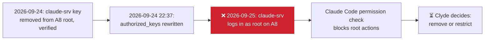
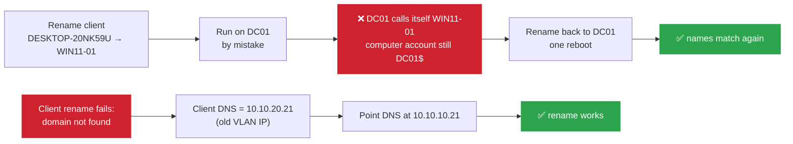

# Incidents Log

> [!NOTE] How this log works
> One section per incident. Newest on top. Each entry: Symptom → Root cause → Fix → Verification → Follow-up. This is the narrative/investigation record: the _current_ state of any system stays in its own reference doc (e.g. [[pfSense Configuration]], [Homelab - Inventory](1%20-%20Infrastructure/Homelab%20-%20Inventory.md)); update those separately if an incident changed something permanently.

## 2026-09-25: claude-srv root key back on proxmox-a8

**Affected:** proxmox-a8 · [[claude-srv]] · [[Tailscale]]

- **Symptom:** while adding svc-01 to Tailscale, `ssh root@100.121.216.124 true` from claude-srv succeeded (exit 0). Line 7 of `/root/.ssh/authorized_keys` on the A8 is `claude-srv@homelab`, and lines 8 to 12 duplicate the keys above it.
- **Root cause:** unknown. The key was added temporarily and removed on 2026-09-24 (verified `Permission denied`). The file's modification time is 2026-09-24 22:37, one minute before claude-srv's reboot; the duplicated block suggests the file was rebuilt from a copy. Not added by the Claude session of 2026-09-25.
- **Fix:** none yet. Claude read the file (read-only) to identify the key; Claude Code's permission check then blocked root actions on the A8, and the Tailscale work was done by Clyde by hand.
- **Verification:** pending.
- **Follow-up:**
  - Remove the `claude-srv@homelab` line and the duplicate block, or replace it with a restricted key (`restrict,command=...`) like the CI deploy key if claude-srv needs A8 access. _(open)_
  - Find what rewrote `authorized_keys` at 22:37 on 2026-09-24 (shell history, `last`, the Proxmox task log). _(open)_

## 2026-09-24: DC01 renamed to WIN11-01 by mistake; client DNS still on old VLAN address

**Affected:** [[DC01]] · [[WIN11-01]] · [[AD Administration]]

- **Symptom 1:** while renaming the client (joined as `DESKTOP-20NK59U`) to `WIN11-01`, the rename was applied on DC01 instead. After its reboot, the RootDSE reported `dnsHostName: WIN11-01.ad.jnclydehl.local` and the site server object was `CN=WIN11-01`, while the computer account stayed `DC01$` / `DC01.ad.jnclydehl.local` and the SRV records still pointed at `dc01`. A DNS A record `win11-01 → 10.10.10.21` was registered. LDAP binds failed with `52e` for the first minute after boot (DC still starting), then worked.
- **Root cause 1:** rename run in the wrong console. ADUC can't rename computer objects (by design: hostname, `sAMAccountName`, DNS and SPNs must change together from the machine itself), so the rename was done through `sysdm.cpl`, on the wrong VM.
- **Fix 1:** snapshot, then renamed back to `DC01` the same way, one reboot. Deleted the stale `win11-01` A record (owned by DC01, so the real client could not have overwritten it under secure dynamic updates).
- **Verification 1:** RootDSE `dnsHostName` and `serverName`, the computer account and the site server object all back to `DC01`; `_ldap` / `_kerberos` SRV records point at `dc01`; no SPN containing `WIN11-01` left on any object.
- **Symptom 2:** on the client, the rename failed with "The specified domain either does not exist or could not be contacted". `nltest /dsgetdc:ad.jnclydehl.local` returned `ERROR_NO_SUCH_DOMAIN`; SRV lookup timed out.
- **Root cause 2:** during the 2026-09-23 move to `proxmox-lab`, the client's IP was changed to `10.10.10.22` but its DNS server stayed `10.10.20.21`, DC01's VLAN 20 address, which no longer exists.
- **Fix 2:** `Set-DnsClientServerAddress -InterfaceAlias Ethernet -ServerAddresses 10.10.10.21`, flush, retry. Rename to `WIN11-01` then succeeded from the client itself.
- **Verification 2:** `nltest` returns DC01; AD object is `WIN11-01$` with `WIN11-01` SPNs; `win11-01` resolves to `10.10.10.22`; stale `desktop-20nk59u → 10.10.20.22` record deleted.
- **Follow-up:**
  - When the VLAN 20 trunk goes in, change the client's DNS to `10.10.20.21` in the same step as DC01's readdressing, or this failure repeats. _(open)_
  - Before any rename or other host-level change, check the hostname at the top of `sysdm.cpl` / run `hostname` first.

## 2026-09-16: LAN gateway auto-selected as default, breaking WAN routing

**Affected:** pfSense · [[pfSense Configuration]]

- **Symptom:** LAN clients got valid DHCP leases and could reach the pfSense GUI, but had no internet access. WAN gateway (`WAN_DHCP`) showed "pending" in Status > Gateways.
- **Root cause:** No IPv4 default gateway was explicitly pinned in System > Routing > Gateways. pfSense's automatic gateway-selection logic defaulted to LAN's gateway (`LANGW`) instead of WAN on every boot/reload: confirmed recurring across multiple reboots in system logs predating this session.
- **Contributing/secondary issue:** During interface reassignment via console (20:13), `dhcpd` briefly failed to bind to LAN ("no subnet declaration for vtnet1"): transient, self-resolved by the next filter reload once the interface's IP was consistently applied.
- **Fix:** System > Routing > Gateways > edit `WAN_DHCP` > check "Default Gateway" (IPv4) > save.
- **Verification:** Status > Gateways shows `WAN_DHCP` online (default); phone regained internet access.
- **Follow-up:** NTP fails to sync (config syntax error in `ntpd` startup, every boot): clock reliability affects log timestamp accuracy; needs separate fix. _(open)_

### Aftermath

- **DHCP Static Mapping:** static mapping conflicted because the main laptop's IP was already taken by a different device: changed from `10.10.10.8` to `10.10.10.23`. _(→ update [Homelab - Inventory](1%20-%20Infrastructure/Homelab%20-%20Inventory.md) main PC row)_
- **Firewall Proxmox rule:** source address updated to match the main laptop's new IP after the change above.