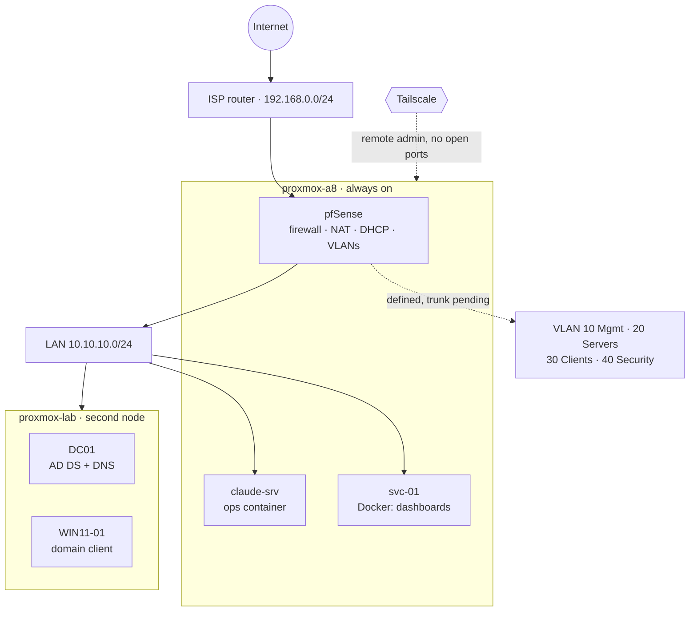

# 🏠 ad.jnclydehl.local: Cybersecurity Career Homelab

**A self-built enterprise network, run through a deliberate career-transition curriculum: understand the system, attack it, detect the attack, fix it.**


---

## 👋 About this lab

I'm Clyde, an IT support technician (N1/N2). My job gives me real enterprise exposure: tickets, Active Directory, M365 and hardware. This repo is where I build what the job doesn't give me: a network I own end to end, that I can **build, break, monitor, and rebuild** on purpose.

The goal is a SOC / red team career. This lab is deliberately not Kali-and-CTFs-first. The order is intentional:

```
IT fundamentals → Sysadmin → Windows/AD → Microsoft Cloud → Networking/Security → Offensive Security
```

You can't attack, or defend, a system you don't understand. So infrastructure fundamentals come first, and offensive tooling stays out of scope until the foundation underneath it is solid.

## 🗺️ Current architecture



- Domain `ad.jnclydehl.local` on Windows Server 2022, one Windows 11 client.
- Two standalone Proxmox nodes (not clustered, on purpose: no quorum risk for the node running the firewall).
- DC01 and WIN11-01 sit on the flat LAN until a managed switch trunks VLAN 20 to the second node. Full detail in the [Inventory](<HomeLab/1 - Infrastructure/Homelab - Inventory.md>).

## 🧰 Stack

| Layer | Tooling |
|---|---|
| Hypervisor | Proxmox VE (2 nodes), LXC + KVM |
| Firewall / Routing | pfSense: explicit allow rules, default deny, per-VLAN DHCP |
| Identity | Windows Server 2022: AD DS, DNS, OUs, security groups (GPOs next) |
| Remote access | Tailscale (no router port forwards) |
| Automation | Bash watchdogs shipped by GitHub Actions: ShellCheck, ephemeral Tailscale node, forced-command SSH key. PowerShell next. |
| Services | Docker on an unprivileged LXC, self-hosted dashboards (Homepage + nginx), Syncthing |
| Planned | Entra ID, Intune, M365, Sysmon, Wazuh SIEM |

## 🔧 Problems solved so far

Real issues from building this, each with symptom, root cause, fix and verification in the docs:

| Problem | Root cause | Where |
|---|---|---|
| LAN had DHCP but no internet after a reboot | pfSense auto-picked the LAN gateway as default, WAN never pinned | [Incidents Log](<HomeLab/Incidents Log.md>) |
| Phones lost internet after the LAN lockdown | Allow rule was TCP only, so DNS (UDP) was dropped | [pfSense Configuration](<HomeLab/2 - pfSense/pfSense Configuration.md>) |
| pfSense admin password crossed the LAN in clear text | WebGUI served over HTTP; switched to HTTPS | [pfSense Configuration](<HomeLab/2 - pfSense/pfSense Configuration.md>) |
| VLAN 20 broke when VMs moved to a second host | Tagging only ever happened inside one Proxmox bridge; no physical 802.1Q path | [Proxmox Lab Setup](<HomeLab/1 - Infrastructure/Proxmox Lab Setup.md>) |
| Windows VM laggy after migration | `cpu: host` pinned to AMD, new node is Intel | [Proxmox Lab Setup](<HomeLab/1 - Infrastructure/Proxmox Lab Setup.md>) |
| DC clock 9 hours ahead | Wrong time zone, time set by hand, no NTP source (breaks Kerberos) | [DC01](<HomeLab/4 - Microsoft/DC01.md>) |
| Container escape risk | Privileged LXC with unconfined AppArmor, rebuilt unprivileged | [svc-01](<HomeLab/6 - Services/svc-01.md>) |
| CI needed SSH into the hypervisor | Deploy key locked to one allowlisted command | [Automation Design](<HomeLab/5 - Automation/Automation Design.md>) |

## 🧭 Roadmap

| Phase | Focus | Status |
|---|---|---|
| A | pfSense: firewall rules, NAT, logging, allow/deny | 🟡 In progress |
| B | VLAN segmentation: Management / Servers / Clients / Security, inter-VLAN control | 🟡 Started (VLANs exist, switch trunk pending) |
| C | Enterprise AD: OUs, groups, service accounts, GPOs, Windows LAPS, delegation | 🟡 In progress (C1 structure done, GPOs next) |
| D | PowerShell / automation: scripted, rebuildable environments | 🟡 Started (CI/CD for Bash watchdogs) |
| E | Microsoft Cloud: Entra ID, hybrid identity, M365, Intune, Autopilot, Conditional Access | ⬜ Pending |
| F | Security monitoring: Sysmon, event logging, SIEM (Wazuh), detection rules | ⬜ Pending |
| G | Offensive security lab: attacker node, recon, AD attacks, privesc, lateral movement | ⬜ Pending |
| H | Red team scenario + professional pentest report | ⬜ Pending |

**Cert path:** SC-900 → AZ-900 → SC-300 → AZ-104 → MD-102 → SC-200

## 📚 Documentation

Docs are split by service: a **Design** doc (architecture and rationale), a **build/implementation** doc (what was actually done), and an **Administration** doc (ongoing ops, dated change log) per component.

| Area | Docs |
|---|---|
| 🖥️ Infrastructure | [Project Overview](<HomeLab/1 - Infrastructure/Homelab - Project Overview.md>) · [Inventory](<HomeLab/1 - Infrastructure/Homelab - Inventory.md>) · [Proxmox Setup](<HomeLab/1 - Infrastructure/Proxmox Setup.md>) · [Proxmox Administration](<HomeLab/1 - Infrastructure/Proxmox Administration.md>) · [Proxmox Lab Setup](<HomeLab/1 - Infrastructure/Proxmox Lab Setup.md>) |
| 🔥 pfSense | [Design](<HomeLab/2 - pfSense/pfSense Design.md>) · [Installation](<HomeLab/2 - pfSense/pfSense Installation.md>) · [Network Configuration](<HomeLab/2 - pfSense/pfSense Network Configuration.md>) · [Configuration](<HomeLab/2 - pfSense/pfSense Configuration.md>) |
| 🌐 Remote Access | [Tailscale](<HomeLab/3 - Remote Access/Tailscale.md>) |
| 🪟 Microsoft / AD | [Active Directory Design](<HomeLab/4 - Microsoft/Active Directory Design.md>) · [AD Administration](<HomeLab/4 - Microsoft/AD Administration.md>) · [DC01](<HomeLab/4 - Microsoft/DC01.md>) · [WIN11-01](<HomeLab/4 - Microsoft/WIN11-01.md>) · [Entra ID](<HomeLab/4 - Microsoft/Entra ID.md>) · [Single Sign-On](<HomeLab/4 - Microsoft/Single Sign-On.md>) |
| ⚙️ Automation | [Design](<HomeLab/5 - Automation/Automation Design.md>) · [Administration](<HomeLab/5 - Automation/Automation Administration.md>) |
| 🧩 Services | [Claude Server Design](<HomeLab/6 - Services/Claude Server Design.md>) · [claude-srv](<HomeLab/6 - Services/claude-srv.md>) · [svc-01](<HomeLab/6 - Services/svc-01.md>) · [Homepage Design](<HomeLab/6 - Services/Homepage Design.md>) · [Homepage](<HomeLab/6 - Services/Homepage.md>) · [Hermes Design](<HomeLab/6 - Services/Hermes Design.md>) · [Hermes](<HomeLab/6 - Services/Hermes.md>) · [Hermes Dashboard Design](<HomeLab/6 - Services/Hermes Dashboard Design.md>) · [Hermes Dashboard](<HomeLab/6 - Services/Hermes Dashboard.md>) |
| 📋 Ops | [Incidents Log](<HomeLab/Incidents Log.md>) · [Security Process](<HomeLab/Security Process.md>) · [Incident Response](<HomeLab/Incident Response.md>) |

## 🚫 Deliberate non-goals (for now)

- No `allow any` firewall rules. The point of Phase A is understanding why a rule works, not making pings succeed.
- No jumping to Kali/exploitation before the infra it would attack actually exists.
- No infra-critical VM (pfSense, the service containers) ever lands on hardware that isn't always-on. The AD lab (DC01, WIN11-01) is a lab: it runs on the on-demand node.

---

<sub>Built and broken by Clyde. IT Support Tech to SOC/Red Team, in progress.</sub>
